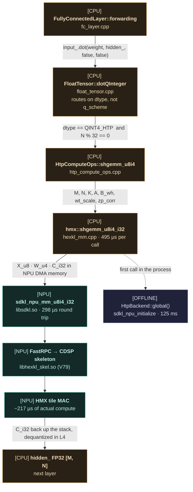
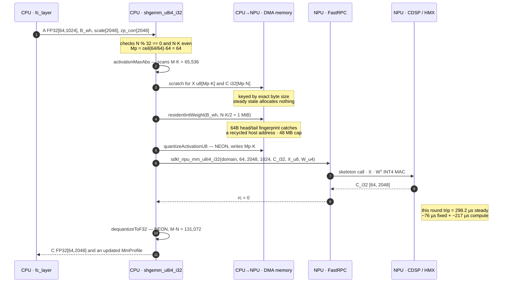
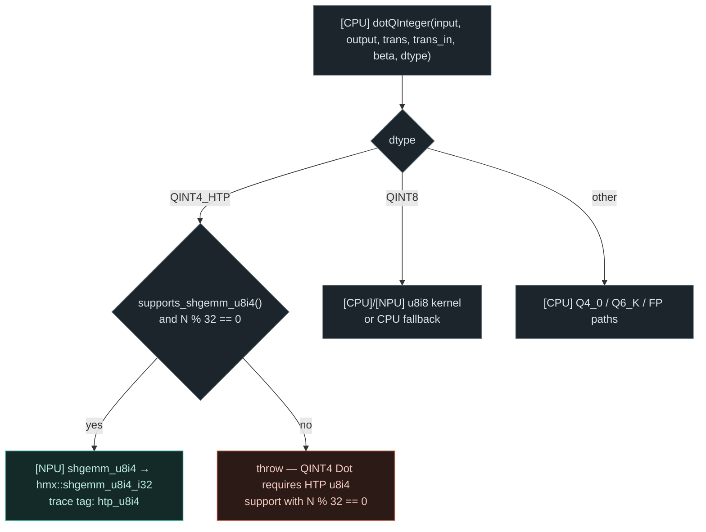

# fc_layer × u8i4_i32 — end-to-end flow on device

The full path an FP32 FC weight travels — baked to INT4, multiplied on Hexagon HMX,
returned as FP32 — traced against a real `hexkl_fc_compare --proj q_proj` run on a
Galaxy S25 Ultra (SM-S938N, Snapdragon 8 Elite).

| | |
| :--- | :--- |
| shape | q_proj, `M=64  N=2048  K=1024` |
| run | `iters=10  warmup=5`, NPU kernels (real device latency) |
| accuracy | relErr `0.07207` vs FP32 (INT8 is `0.00547`) |
| kernel | steady `298.2 µs` per `sdkl_npu_mm_u8i4_i32` |
| source | branch `claude/htp-qnn-fc-compare`, sdkl / HexKL 6.4.0.1 |

Every node in the diagrams below is tagged with where the work happens:

| tag | meaning |
| :--- | :--- |
| **`[CPU]`** | ARM host, in-process (quantize, dequantize, staging, dispatch) |
| **`[NPU]`** | Hexagon CDSP / HMX, across the FastRPC boundary |
| **`[OFFLINE]`** | one-time — model bake, build, deploy, or process init; never a per-call cost |

---

## 1. Four stages, and how often each one runs

Only the last stage repeats. The large numbers in the run log — 125 ms of init,
3.8 ms of WH packing — all belong to the earlier stages, so none of them is a
per-call cost.

Stage B in full: `package_android.sh -Denable-htp=true -Dhexkl-lib-subdir=armv8_android26`
produces `libnntrainer.so`; it ships to `/data/local/tmp` alongside `libsdkl.so` and the
V79 CDSP skeleton `libhexkl_skel.so`, with `LD_LIBRARY_PATH` and `ADSP_LIBRARY_PATH`
pointed at that directory.

---

## 2. Stage A — FP32 weight to packed INT4 WH

`nntr_quantize` runs this once. Whatever comes out is handed to the kernel verbatim as
`B_wh`; the runtime never re-packs.

**Why the transpose:** an FC weight is `TensorDim(1,1,K,N)` — physically `[K,N]`
row-major — while sdkl's WH bake and matmul both assume `[N,K]`. Relabelling the dims
without moving bytes scrambles every element's tile position; that was a real bug on the
FP16 path.

---

## 3. The runtime call chain

This is the part that runs on every token. The layer never names a kernel — it calls
`dot()`, and the choice is made two frames below, on the weight's dtype.

### What each frame is responsible for

| frame | decides | side |
| :--- | :--- | :--- |
| `fc_layer::forwarding` | nothing about quantization — issues a plain `dot()` | **CPU** |
| `dotQInteger` | u8i4 vs u8i8 vs CPU, keyed on dtype; guards `N % 32 == 0` | **CPU** |
| `HtpComputeOps` | ops-table override; `supports_shgemm_u8i4()` tracks NPU availability | **CPU** |
| `shgemm_u8i4_i32` | activation scale, NEON quantize, scratch + weight residency, dequantize | **CPU** |
| `sdkl_npu_mm_u8i4_i32` | marshals the call over FastRPC; M padded to the 64-row tile | boundary |
| HMX | the INT4 MAC itself, serialized behind `sdkl_npu_lock_hmx` | **NPU** |

---

## 4. Inside one kernel call

`hmx::shgemm_u8i4_i32` splits into five phases, recorded unconditionally into
`MmProfile` — five `steady_clock` reads against a ~300 µs call, so there is no flag to
enable and no profile nobody has.

Scan + quantize + dequantize come to roughly **197 µs on the host (CPU) side**.

### The constants the kernel works with

| symbol | definition | on q_proj |
| :--- | :--- | :--- |
| `act_scale` | `max abs A / 127` — one per tensor, zero-point 128 | scans M·K = 65,536 |
| `X_u8` | `clamp(round(A / act_scale) + 128, 0, 255)` | `[64, 1024]` u8 |
| `scale[n]` | `max abs W[n,:] / 7` — one per output channel | 2,048 entries |
| `q[n,k]` | `clamp(round(W / scale[n]), -7, 7)` | 2 nibbles per byte |
| `zp_corr[n]` | `128 · Σ_k q[n,k]` — cancels the activation zero-point | 2,048 i32 |
| `C[m,n]` | `act_scale · scale[n] · (C_i32[m,n] − zp_corr[n])` | M·N = 131,072 |
| `Mp` | `ceil(M / 64) · 64` — SDKL 64-row tile padding | 64 → 64, no padding |

The correction term is exact, not approximate:
`C_i32[m,n] − zp_corr[n] = Σ_k (X_u8[m,k] − 128) · q[n,k]`. The NPU multiplies unsigned
bytes as they are, and one line of dequantize undoes the offset.

---

## 5. How `dot()` lands on u8i4

The branch keys on **dtype, not q_scheme** — a loaded weight's q_scheme value does not
reliably round-trip through save and load, while `QINT4_HTP` uniquely identifies the
INT4 path.

> **There is no CPU fallback for u8i4 yet.** u8i8 drops to `qint8CpuFallback` when the
> NPU is down; QINT4_HTP throws instead (the TODO is still in the source). On a device
> without the NPU, or on a shape whose N is not a multiple of 32, this path is
> unavailable.

---

## 6. Measured — Galaxy S25 Ultra, q_proj

The run below used `--engine sdkl`: the app drives `sdkl_npu_mm_*` itself and times each
phase separately, which is why alloc, H2D and WH pack appear at all. **A real fc_layer
pays none of those three per call** — WH packing finishes offline, and the
resident-weight cache absorbs the allocation and upload into the first call.

### Phases as measured (`--engine sdkl`, iters = 10)

| phase | u8i8 µs | u8i4 µs | in a real fc_layer |
| :--- | ---: | ---: | :--- |
| `sdkl_npu_initialize` | 124,995.9 | — | **OFFLINE** — once per process |
| Cold run (first execute) | 2,300.6 | 425.6 | **OFFLINE** — once per process |
| Steady NetRun (mean execute) | 2,161.9 | 298.2 | **NPU** — every call |
| alloc | 576.8 | 791.1 | **OFFLINE** — removed by scratch reuse |
| H2D copy (act + weight) | 192.2 | 194.6 | **CPU** — activation only |
| WH pack (RM→WH) | 29,716.1 | 3,776.2 | **OFFLINE** — offline bake |
| D2H copy (int32 accumulator) | 173.8 | 152.2 | **CPU** — folded into dequantize |
| relErr vs FP32 | 0.00547 | 0.07207 | INT4 = 13.2× the INT8 error |

### What an fc_layer actually pays (`--engine nntr`)

| item | µs | note |
| :--- | ---: | :--- |
| HexKL steady, per call | **495** | one fc_layer matmul, weight resident |
| HexKL first call | 1,214 | the call that uploads the weight |
| matmul alone | 298 | **NPU** — `sdkl_npu_mm_u8i4_i32` round trip |
| └ fixed overhead | ~76 | FastRPC round trip + kernel setup (`--sweep`) |
| └ compute | ~217 | HMX MAC |
| host quantize + dequantize | ~197 | **CPU** — 495 − 298, NEON-vectorized |
| QNN NetRun, same shape | 513 | 495 vs 513 is the like-for-like number |

So of the 495 µs, **298 µs is the NPU round trip and 197 µs is quantize/dequantize on
the ARM side**. The HMX matmul is serialized behind `sdkl_npu_lock_hmx`, but the
quantize/dequantize work is element-wise and is the one remaining host-side lever.
Threading it was tried and reverted — the median fell from 542 to 357 µs while the mean
rose from 545 to 608 — which is why NEON, not `parallel_for`, is what shipped.

---

## 7. Where the code lives

| stage | file | symbol |
| :--- | :--- | :--- |
| INT4 bake + WH pack | `nntrainer/tensor/quantizer.cpp` | `quantize_qint4_weight` |
| dtype branch on save | `nntrainer/layers/layer_devel.h` | `LayerImpl::save` |
| NPU session lifecycle | `nntrainer/tensor/htp_backend/htp_backend.cpp` | `HtpBackend::global` |
| dot routing | `nntrainer/tensor/float_tensor.cpp` | `FloatTensor::dotQInteger` |
| ComputeOps dispatch | `nntrainer/tensor/htp_backend/htp_compute_ops.cpp` | `HtpComputeOps::shgemm_u8i4` |
| kernel body | `nntrainer/tensor/htp_backend/hmx_ops/hexkl_mm.cpp` | `hmx::shgemm_u8i4_i32` |
| NEON quantize / dequantize | `nntrainer/tensor/htp_backend/hmx_ops/hexkl_quant.h` | `quantizeActivationU8`, `dequantizeToF32` |
| weight residency + scratch | `nntrainer/tensor/htp_backend/hmx_ops/hexkl_mm.cpp` | `residentIntWeight`, `NpuScratch` |
| measurement app | `Applications/HexKLFcCompare/jni/hexkl_fc_compare.cpp` | `runNpu`, `runViaNntrainer` |
| on-device kernel test | `test/unittest/unittest_nntrainer_htp_kernels.cpp` | `FcMm_Compare_HexKL_u8i4_u8i8` |

The code paths above live on branch `claude/htp-qnn-fc-compare`, alongside the
`01`–`07` HTP backend guides in this directory. The `--engine nntr` and QNN figures come
from `06_fc_mm_hexkl_vs_qnn.md`.
