<!-- SPDX-License-Identifier: Apache-2.0 -->

# 35 -- Keeping HMX and HVX both busy: ceiling, feasibility, staging

Proposal: put a job queue in front of HMX so it never idles while HVX works,
the way llama.cpp ggml-hexagon does (`htp/hmx-queue.c`, `matmul-ops.c`).
This is the analysis before any code -- what the ceiling is from OUR measured
numbers, what in our code blocks it, and what order to build it in.

Nothing here is implemented. Doc 34 is the run every number comes from.

## 1. First, the premise

The stated motivation was that QNN keeps HMX and HVX both running and is
therefore >2x faster. **The QNN profile we have says the opposite about that
op**: its stages sum to 44.5 + 69.9 + 151.1 + 72.9 + 5.2 = 343.6 us against
an accelerate-execute total of 347. Stages that overlap cannot sum to the
total -- the sum would exceed it. Their own "idle / misc / overlap" bucket is
5.2 us, 1.5%. So within one FC op, QNN is serialized too, and doc 34's
verdict stands: 156 vs 347 us on the device timeline, us faster.

That does not kill the idea, it relocates it. Overlap across a whole graph
(op i+1's input staging under op i's compute) is a different and plausible
claim about QNN, and if the >2x came from a full-model run rather than this
op, that is the measurement to put beside ours -- **doc 34 §1 still has empty
QNN cells at seq 512/1024, and this proposal should not be sized off a number
we do not have.**

The reason to do it anyway is that **our own breakdown shows the headroom**,
independent of QNN. That is §2.

## 2. The ceiling, from the measured split

Every stage belongs to exactly one unit. HMX lane = micro-mm + acc_read (one
hardware accumulator, so they serialize with each other). HVX lane = quant +
dequant. DMA = drain, already its own lane and already overlapped.

| shape | dsp | HMX | HVX | DMA | bound by | full overlap | dequant only |
|---|---|---|---|---|---|---|---|
| i4 x1 M=1 | 113 | 60 | 17 | 36 | HMX | 1.18x | 1.09x |
| i4 x1 M=64 | 156 | 66 | 55 | 35 | HMX | **1.54x** | 1.27x |
| i4 x1 M=512 | 1,113 | 508 | 567 | 38 | HVX | **1.96x** | 1.42x |
| i4 x1 M=1024 | 2,229 | 999 | 1,191 | 39 | HVX | **1.87x** | 1.37x |
| i8 x1 M=1024 | 2,308 | 1,040 | 1,194 | 74 | HVX | 1.93x | 1.38x |
| i4 x6 M=512 | 5,055 | 2,943 | 2,072 | 40 | HMX | 1.72x | 1.56x |
| i4 x6 M=1024 | 9,975 | 5,888 | 3,969 | 118 | HMX | 1.69x | 1.53x |

"full overlap" = DMA prologue + max(HMX, HVX); "dequant only" = quant still
runs alone up front. Both are ceilings, not predictions -- §6 discounts them.

Three things this table settles:

- **The prize is 1.5-2.0x on dsp_total for M >= 64.** Larger than anything
  left on 32_after_the_copy.md's list.
- **At x1 we are HVX-bound; at x6 we are HMX-bound.** The group call already
  saturates HMX, so a queue's job there is to stop HMX waiting on dequant,
  and the end state (HMX the critical path, 1.69x) is the healthy one.
- **Decode (M=1) is not the target.** 1.18x of a 113 us kernel, against 326
  us of FastRPC in the same call. Decode's problem is transport; leave it.

For ranking against the other open item: attention prefill kv=1024 is
dsp 6,820 with HVX 5,206 and HMX 1,614, a **1.31x** ceiling. FC is the better
target by a wide margin, which reverses doc 32 §3's ordering (it had the HMX
thread at #4 on an attention-only estimate).

## 3. Two increments, separately valuable

```mermaid
gantt
  title M=1024 i4 -- today vs the two stages (us)
  dateFormat X
  axisFormat %s
  section today 2229
  quant 633        : 0, 633
  mm+acc_read 999  : 672, 1671
  dequant 558      : 1671, 2229
  section stage 1 -- 1632
  quant 633        : 0, 633
  mm+acc_read 999  : 672, 1671
  dequant (hidden) : 700, 1258
  section stage 2 -- 1191
  quant (pipelined): 0, 700
  mm+acc_read 999  : 40, 1039
  dequant (hidden) : 100, 658
```

**Stage 1 -- overlap dequant with the multiply. 1.37-1.56x.** Tile i+1's
micro-mms run while tile i's dequant runs on the worker pool. Needs a second
result tile in VTCM and an async submit on the pool. Self-contained.

**Stage 2 -- pipeline the activation quant per row-block. 1.87-1.96x.** Today
quant packs the WHOLE activation to AH before the first multiply, and at
M=1024 that is 633 us of dead HMX time. Row-blocks are independent and the AH
layout is already per-(row block, k tile) at a 2,048-byte stride, so quanting
rb+1 while multiplying rb needs no layout change. This is where the bulk of
the win is at prefill, and it is the harder of the two.

## 4. Feasibility: three structural facts

**(a) The HMX lock is thread-affine, and this is the one real risk.**
ggml's HMX thread calls `HAP_compute_res_hmx_lock()` *inside its own loop*
(`hmx-queue.c:46-49`) rather than inheriting a lock -- that is only necessary
if the lock binds to a thread. Our `hexkl_micro_hmx_lock()` is taken once in
`nntr_hvx_open` (`hvx_add_f32.c:78`) and used by layer calls that arrive on
later FastRPC invocations, which means either the lock is not thread-affine
or FastRPC pins a session to one thread. **We do not know which, and a
dedicated HMX thread turns that unknown into a hard dependency.**

**This is why stage 1 should NOT copy ggml's topology.** Invert it:

| | who drives HMX | who does HVX | HMX lock |
|---|---|---|---|
| ggml | a dedicated queue thread | caller + pool | must move to that thread |
| **ours (proposed)** | **the caller thread, as today** | **pool workers, async** | **untouched** |

Same overlap, no new thread, no lock question. The HMX side stays exactly the
code that is already gated bitwise. If stage 2 later wants a real HMX thread,
the lock question can be answered then, by a 20-line experiment (lock on
thread A, issue one micro-mm on thread B, check the result) rather than
discovered mid-implementation.

**(b) One accumulator, so the pipeline is 2-stage, not deeper.** HMX cannot
start tile i+1 until `acc_read(i)` has drained the accumulator to VTCM. So
the structure is fixed: `[clear, mm x k_tiles, acc_read -> buf A]` for tile i
while HVX dequants `buf B` from tile i-1. Two result buffers, alternating.
Deeper pipelining buys nothing.

**(c) The worker pool is fork-join only.** `hvx_worker_pool_run()` blocks and
runs unit 0 on the caller. Stage 1 needs `submit()` + `wait()` with every
unit on a worker, since the caller is busy issuing HMX. That is an addition
to `hvx_worker_pool.{c,h}`, not a rewrite -- the parked-thread machinery and
the `(n_threads, i, ctx)` contract already exist.

## 5. Granularity and VTCM budget

**Per tile is far too fine.** At M=1024 dequant is 558 us over 1,024 tiles =
**0.55 us per tile**, against a fork/join the pool measured in the multi-us
range (32_after_the_copy.md: "the pool pays at the >= 100 us jobs it now
runs"). A job per tile would be pure overhead -- this is exactly the
measurement that killed pooling the tile dequant the first time.

Pipeline a **chunk of N-tiles** instead, 16 of them:

| | per 16-tile chunk, M=1024 |
|---|---|
| HMX work (mm + acc_read) | 15.6 us |
| HVX work (dequant) | 8.7 us |
| VTCM staging, double-buffered | 16 x 8,192 x 2 = **256 KB** |

Both sides are comfortably above fork/join, and 256 KB fits: at M=1024 i8 the
arena currently peaks at 5.25 MB of ~8.3 MB usable, and at i4 3.15 MB. The
chunk size is one constant and should be swept once on device rather than
argued about.

One correctness detail: `hexkl_acc_layout_get()` derives the accumulator
permutation by ramp-probing at ONE `result_off`. With two buffers the probe
must either run at both offsets or assert they agree -- cheap, and it fails
loudly rather than silently producing wrong bytes.

## 6. What discounts the ceiling

**VTCM bank contention, already measured on this device.** 32
_after_the_copy.md §5: moving a pool-parallel working set into VTCM made
prefill softmax **+30%** while the single-threaded decode path was unchanged
to the microsecond -- six HVX threads contending for VTCM banks lost to six
threads hitting L2. Stage 1 puts HMX writing a VTCM tile next to workers
reading a VTCM tile, which is the same class of contention. Expect to land
below the ceiling; **plan for 1.4-1.6x at prefill, not 1.9x**, and treat
anything above that as a bonus.

Second, the probes themselves stop being additive once stages overlap:
`quant_us + dequant_us + ...` will exceed `dsp_total`, and the report's
"remainder = micro-mm" arithmetic silently breaks. The instrumentation needs
a per-lane total before the breakdown means anything again.

## 7. Staging, with a gate on each step

| step | work | gate before continuing |
|---|---|---|
| 0 | per-lane probe totals + a `pipelined` flag in FC_STAGE; report shows both lanes | breakdown still sums correctly with overlap off |
| 1 | `hvx_worker_pool_submit/wait`; second result buffer; layout probe asserts both offsets agree | existing bitwise timed==production gate PASSes at all 24 rows |
| 2 | chunked dequant pipeline (HMX on caller, HVX async) | bitwise gate PASSes; dsp_total drops; sweep the chunk size |
| 3 | per-row-block quant pipelining | bitwise gate PASSes; dsp_total approaches max(HMX, HVX) |
| 4 | only if 1-3 land and HMX is still the critical path: the real HMX thread, after the lock experiment | -- |

Stop at any step that does not move `dsp_total`. Step 1 is a few dozen lines
and answers whether the contention in §6 eats the win, which is the thing
worth knowing before steps 2-4 are worth writing.

## 8. Where this does NOT help

- **Decode.** 1.18x of 113 us against 326 us of transport in the same call.
- **The f32 interface.** Doc 34 §5's u8-in/u8-out endpoint removes quant and
  dequant outright rather than hiding them, cuts the FastRPC payload 4x, and
  the two do not compose: with quant/dequant gone the HVX lane collapses and
  overlap has little left to hide. **Decide which one first** -- on the
  measured split they attack the same 53%, and the u8 endpoint is the one
  that also helps decode.
