<!-- SPDX-License-Identifier: Apache-2.0 -->

# 37 -- T2 design: pipelining attention so HMX and HVX both run

Design doc for doc 36's T2. Doc 36 gives it one paragraph and the number
"~1.85x"; this says what that number is a number *of*, what the two candidate
mechanisms are, why only one of them should be built first, and what has to be
true before any of it is measurable.

Not implemented. Prerequisite: **T1 (integer requantize) lands first** -- doc
35 §3, and §1 below re-derives why for attention specifically.

## 1. What "1.85x" refers to, and what attention alone actually gets

The number is **block-scope**, not SDPA-scope, and the two differ enough to
change the plan.

Overlap can remove at most `min(HVX_total, HMX_total)` -- you cannot hide more
of one lane than the other lane has room for. So:

| scope | | HVX | HMX | total | ceiling |
|---|---|---|---|---|---|
| SDPA (kv=1024 prefill) | today | 5,206 | 1,614 | 6,820 | 1.31x |
| SDPA | after T1 | 2,740 | 1,614 | 4,354 | **1.59x** |
| whole block | after T1 | 3,731 | 4,396 | 8,127 | **1.85x** |

Derivation chain, so the confidence is visible: SDPA's lanes are **measured**
(doc 32 §5: dequant 2,357, quant 1,166, softmax 806, gather 877, dsp_total
6,820). "After T1" assumes the integer requantize keeps ~30% of quant+dequant
-- an **assumption**, not a measurement. The block row adds q/k/v and o_proj
**scaled from measured q_proj** (doc 35 §2). So 1.59x rests on one assumption,
1.85x on two.

**The consequence for ordering:** T2 confined to SDPA is worth 1.59x; T2 across
a fused block is worth 1.85x. That is why doc 36 §5 puts **T3 (fuse the block)
before T2** -- the projections are where the HMX work is, and without them
attention's HMX lane is only 37% of its own post-T1 total. Building T2 inside
SDPA alone leaves HMX idle 63% of the time no matter how well it is scheduled.

## 2. Two levels of pipelining -- and they share ONE budget

The fused loop today (`hexkl_attn_u8.c:397`):

```
for n in kv_heads:
  for b0 in query rows, step M_band:
    gather   q rows -> q_gather                      HVX-ish (scalar memcpy)
    PHASE A  scores(): ALL n_blocks in one call      HMX + HVX interleaved
    PHASE B  softmax over the whole band             HVX (worker pool)
    PHASE C  per block: P.V                          HMX + HVX interleaved
```

PHASE A and C are already mixed lanes: inside `layer_run` the per-tile
sequence is `mm -> acc_read -> dequant`, i.e. HMX then HVX, **sequentially**.
So there are two distinct places to pipeline:

| level | what overlaps what | HVX work it hides | scope |
|---|---|---|---|
| **tile** | `mm(i+1)` ‖ `dequant(i)`, inside `layer_run` | dequant | A and C; **also FC** |
| **band** | band `k+1`'s PHASE A ‖ band `k`'s PHASE B | softmax, gather | attention only |

They hide **different** HVX work but draw on the **same** HMX lane. The bound
is `min(HVX, HMX)` for the whole call regardless of mechanism, so:

> **These do not multiply. Planning "1.6x from tiles times 1.3x from bands" is
> wrong** -- together they still cannot exceed the §1 ceiling.

After T1, SDPA's hideable HVX is ~1,057 of dequant+quant against 1,614 of HMX.
**Tile-level pipelining alone can absorb all of it.** Band-level only becomes
useful if tile-level leaves HMX idle -- i.e. once softmax (806) and gather
(877) are the residual, which is exactly the post-T2 state §6 describes.

**Therefore: build tile-level only.** It is doc 35 §4-§5's design unchanged, it
needs no cross-band state, and it pays in FC too. Band-level is a contingency
with a measurement gate in front of it (§5 step 4), not a plan.

```mermaid
gantt
  title SDPA after T1, one band -- today vs tile-pipelined
  dateFormat X
  axisFormat %s
  section today
  PHASE A  mm (HMX)      : 0, 40
  PHASE A  dequant (HVX) : 40, 66
  PHASE B  softmax (HVX) : 66, 86
  PHASE C  mm (HMX)      : 86, 106
  PHASE C  dequant (HVX) : 106, 118
  section tile-pipelined
  PHASE A  mm (HMX)      : 0, 40
  PHASE A  dequant hidden: 8, 34
  PHASE B  softmax (HVX) : 40, 60
  PHASE C  mm (HMX)      : 60, 80
  PHASE C  dequant hidden: 66, 78
```



Shape only -- the bars are proportions from §1's lane split, not measurements.
Note what the figure makes obvious: **softmax stays exposed.** That is the
band-level gap, and §6 is about whether it is worth closing.

## 3. What has to change

Three code changes, all previously scoped in doc 35 §4-§5:

1. **`hvx_worker_pool_submit()` / `_wait()`.** The pool is fork-join only;
   `hvx_worker_pool_run()` blocks and runs unit 0 on the caller. Pipelining
   needs every unit on a worker, because the caller is busy issuing HMX. The
   parked-thread machinery and the `(n_threads, i, ctx)` contract already
   exist -- this is an addition, not a rewrite.
2. **A second accumulator result buffer in VTCM**, alternating per chunk.
   `hexkl_acc_layout_get()` ramp-probes the permutation at ONE `result_off`;
   with two it must probe both or assert they agree, and fail loudly rather
   than silently emit wrong bytes.
3. **Chunked, not per-tile.** Dequant is ~0.55 us per tile against a
   multi-microsecond fork/join -- doc 32 already measured that and it is what
   killed pooling the tile dequant the first time. Pipeline a chunk of 16
   N-tiles: ~15.6 us HMX against ~8.7 us HVX per chunk, 256 KB of
   double-buffered VTCM staging. Chunk size is one constant, swept on device.

**Topology: HMX stays on the caller thread**, dequant goes async to the pool
(doc 35 §4a). ggml locks HMX *inside* its own queue thread
(`hmx-queue.c:46-49`), which is only necessary if the lock is thread-affine;
ours is taken once in `nntr_hvx_open` and used from later FastRPC calls, and
we do not know which of those two facts explains it. Inverting the topology
means never having to find out.

## 4. Instrumentation has to change BEFORE the code

Once stages overlap, `quant_us + dequant_us + acc_read_us + ...` exceeds
`dsp_total_us`, and the reports' "remainder = micro-mm" arithmetic breaks
**silently** -- it will print a plausible negative-ish number rather than
fail. Both `tools/htp_fc_report.py` and `tools/htp_attn_report.py` derive the
micro-mm term that way today.

So step 0 of the build is: **per-lane totals** (`hmx_busy_us`, `hvx_busy_us`)
plus a `pipelined` flag in the stage vector, and reports that show lane
occupancy instead of a stacked breakdown when the flag is set. Without it,
a working pipeline and a broken one produce the same-looking report.

This is also T5 (doc 36) arriving early, and it is worth doing for its own
sake: it gives us the parallel-compression figure that is currently the one
QNN number with no counterpart on our side (1.0x vs their 4.1x).

## 5. Staging, with a gate on each step

| step | work | gate before continuing |
|---|---|---|
| 0 | per-lane busy totals + `pipelined` flag; reports show occupancy | with overlap OFF, lanes sum to `dsp_total` |
| 1 | `hvx_worker_pool_submit/wait`; unit 0 moves off the caller | every existing bitwise gate still PASSes, timings unchanged |
| 2 | second result buffer + layout probe asserts both offsets | bitwise gates PASS; `acc_stride` reported for both buffers |
| 3 | chunked tile pipelining in `layer_run` (FC and attention share it) | bitwise PASS; `dsp_total` drops; sweep chunk size; **lanes overlap in the occupancy view** |
| 4 | ONLY if step 3 leaves HMX idle and softmax exposed: band-level | measured HMX idle > 25% after step 3 |

Step 1 is separable and worth landing alone: it changes no arithmetic, so any
timing change it causes is pure scheduling noise and tells us the pool's
async path is sound before correctness and performance are both in flight.

## 6. What T2 cannot fix, and what that implies

After T1 and a perfect T2, SDPA's residual is **softmax 806 + gather 877 =
1,683 us** with HMX exhausted. Two observations follow, both for a later doc
rather than this one:

- **`gather` at 877 us is a scalar `memcpy` loop** (`hexkl_attn_u8.c:402-409`)
  copying q rows into `q_gather` one head at a time. It is 20% of post-T1 SDPA
  and nothing in T1-T4 touches it. It should be measured in cycles/element
  (T5) before anyone assumes it is cheap -- this is precisely the shape of
  QNN's own `mul_op` blind spot (ref_16 §9.1).
- **Softmax at 806 us is already pool-parallel** and doc 32 §5 measured it
  getting *worse* in VTCM. The remaining lever there is algorithmic (online
  softmax, ref_16 §9.3), not scheduling.

## 7. Record when done

Whatever happens, write the outcome into doc 32 §5's "falsified on device"
section in the same form: the A/B table with everything else fixed, and the
stage that moved. Two specific predictions to score:

1. tile pipelining reaches within 20% of the §1 ceiling for its scope, **or**
   VTCM bank contention eats it -- doc 32 §5 measured a pool-parallel stage
   losing 30% to exactly that, and this puts HMX writing a VTCM tile beside
   workers reading one;
2. band-level is unnecessary because step 3 already exhausts HMX.

If (1) fails the way doc 32 §5 predicts, T2 is dead for the same reason
s_band-in-VTCM was, and the honest move is to record it and go straight to §6's
algorithmic items.
