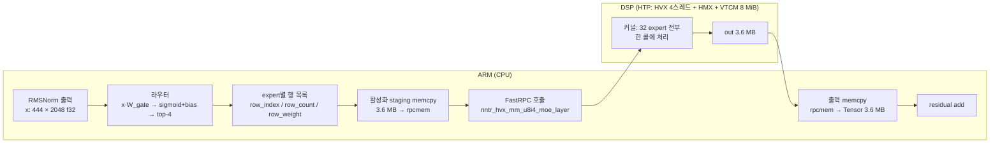
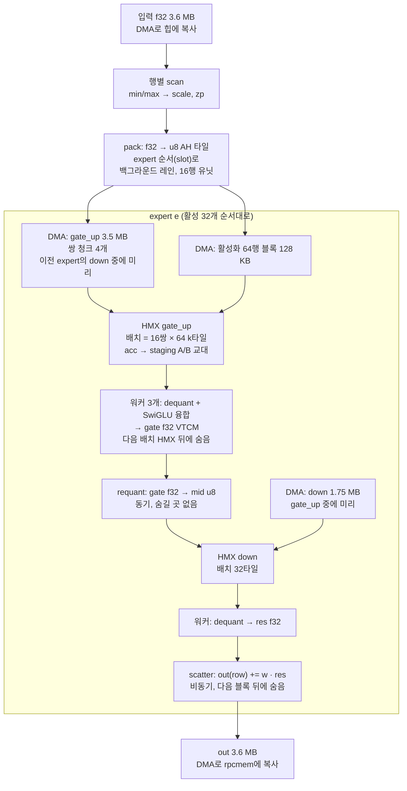

# 49 — LFM2.5-8B-A1B의 MoE FFN을 NPU(HexKL/HMX)로: 무엇을 얼마나 빠르게 했고, 어떻게 도는가 (2026-09-16)

이 문서는 설명용이다. 지금까지의 결과를 사람이 읽고 남에게 설명할 수 있게 한 곳에
모았다. 숫자는 전부 기기 실측(Snapdragon, HTP v79, `NNTR_HTP_PROFILE`/`--profile`)이고,
어디서 나온 값인지 문서 번호를 달았다. 설계 근거와 실패 기록은 문서 46·47·48에 있다.

---

## 1. 한 장 요약

**목표**: LFM2.5-8B-A1B(MoE)의 FFN(expert 행렬곱)을 Qualcomm HTP의 행렬 유닛(HMX)에서
돌려 CPU보다 빠르게. 다른 레이어(conv, attention, norm, lm_head)는 CPU에 두고 비교한다.

| | **CPU** (원본 흐름 = PR 4264: 전 레이어 Q4_0, MoE는 ggml Q4_0 GEMM, 8스레드) | **NPU** (MoE만 QS4CX_WH, HexKL HMX, 8스레드) | 배율 |
|---|---:|---:|---:|
| **expert FFN 루프**, **22층 평균** (한 층 = expert 32개 × [M×2048×3584 → SwiGLU → M×1792×2048], M 합 1776, 39 GFLOP, 크기는 §2.1. 라우터·gather·scatter 제외. 같은 `M0` `ffn` 타이머) | 34.4 ms (층별 31.4–36.6) | **17.4 ms** (층별 15.6–18.6; 그중 DSP 내부 15.2, 순수 HMX 12.2) | **2.0×** (DSP 내부만 세면 2.3×) |
| **MoE 레이어 전체**, 22층 평균 (같은 `M0` `us` 타이머) | 40.9 ms (37.2–43.6) | **18.4 ms** (16.5–19.5) | **2.2×** |
| **prefill 전체** (444 토큰, 24층, 최솟값) | 334 TPS (1329 ms, 5회) | **523 TPS (848 ms, 3회)** | **1.6×** |
| **decode** (토큰 1개, 512 생성) | **48 TPS** (20.8 ms/token) | 20.8 TPS (48 ms/token) | **0.43×** (CPU가 빠름) |

**출처.** 두 열 모두 2026-09-16/17, 같은 기기, 같은 프롬프트, `NNTR_NUM_THREADS=8`, 같은 `--htp` 바이너리,
decode TPS로 열 게이트 확인. 전체 로그와 22줄 분해는 §6.1.1.

| 열 | 모델 · 경로 | 어디서 |
|---|---|---|
| CPU | `lfm2.5-8b-a1b-q40`: `nntr_quantize_stream --fc_dtype Q4_0 --embd_dtype Q4_0 --lmhead_dtype Q4_0 --isa ARM` (`--moe_dtype` 없음 → expert도 Q4_0), `nntr_config.json`에 `moe_engine` 없음 | 비프로파일 5회 1847/1371/1470/1329/1351 ms, decode 47–49 TPS. `NNTR_M0_PROFILE=1` 2회 × 22줄 평균 |
| NPU | `lfm2.5-8b-a1b-q40-qs4cx-wh`: 같은 FP32에서 MoE만 `--moe_dtype QS4CX_WH`, `moe_engine: htp` | 비프로파일 3회 최솟값 848 ms (09-16). `NNTR_M0_PROFILE=1` 22줄 평균 (09-17): 레이어 18.40, `ffn` 17.44 — 문서 47 §22.2의 host 17.5 + ARM 0.9 추정과 일치 |

두 모델은 MoE expert의 양자화 값이 다르다(Q4_0은 32개 블록마다 scale, QS4CX_WH는 채널당
scale). 그래서 출력 텍스트도 다르다(CPU는 긴 `<think>` 뒤 잘림, NPU는 3문장 요약). 비교는
"upstream CPU 구현 그대로" 대 "MoE를 NPU로"이고, 같은 int4 값끼리의 비교(QS4CX CPU, KleidiAI)는
이전 문서(43·44·46·48: 4스레드, 26.3 / 31.8 ms, 279 / 35 TPS)에만 있고 여기서는 비교군에서
뺐다.

**원본 흐름 CPU 레이어의 분해** (`[M0-PROF]` 22줄 × 2회 = 44줄 평균, us → ms). 한 줄이 한 층이고,
층마다 라우팅이 달라 값이 흔들린다 — M의 합은 1776으로 같지만 expert별 분포가 달라 NPU 쪽은
64행 블록 수(패딩)까지 달라진다:

| 단계 | ms | NPU 경로에서는 |
|---|---:|---|
| setup / router / topk | 0.04 / 0.75 / 0.11 | 같은 ARM 코드 |
| wksp (CPU 워크스페이스 할당·zero-fill) | 1.68 | 없음 (E1로 건너뜀) |
| gather (토큰 → expert 순서 복사) | 1.10 | DSP pack이 대신 (bg 레인, 숨음) |
| **ffn** (Q4_0 GEMM gate_up → SwiGLU → GEMM down, 32 expert) | **34.4** | **17.4** = staging memcpy 0.9 + FastRPC 콜 16.5 (DSP 내부 15.2 = HMX 12.2 + 노출 3.0, 나머지 전송) |
| route (라우팅 가중치 곱) + scatter | 1.46 + 1.23 | DSP scatter 잡 (숨음) |
| **레이어** | **40.9** (37.2–43.6, 2회 44줄) | **18.4** (16.5–19.5, 22줄) |

ffn 34.4 ms = 39.1 GFLOP → CPU **1.14 TFLOPS**; NPU `ffn` 17.4 ms → 2.24 TFLOPS, DSP 내부 15.2 →
2.57, HMX만 12.2 → 3.2 (패딩 포함 5.3).

세 줄로 읽으면:

1. **prefill(여러 토큰)에서는 NPU가 이긴다.** expert FFN 루프 2.0배, MoE 레이어 2.2배, prefill
   전체 1.6배(MoE가 prefill의 45~66%라 Amdahl). 처음 NPU 버전은 181 TPS로 CPU(334)보다 느렸고,
   아래 §5의 최적화로 523까지 올렸다.
2. **decode(토큰 1개)에서는 아직 CPU가 이긴다.** 토큰 하나는 계산이 아니라 가중치 읽기
   (DDR 대역폭)가 전부라서, 누가 계산하느냐보다 누가 DDR을 빨리 읽느냐다. NPU 경로는
   64행 단위 계산의 낭비와 콜당 전송 비용까지 얹혀 20.8 TPS — CPU 48 TPS의 0.43배다(문서 48).
3. **NPU 커널은 바닥에 닿았다.** 콜 17.5 ms 중 82%가 하드웨어 구조(HMX 타일, accumulator
   읽기)와 전송 바이트다. 다음 배수는 커널 안이 아니라 ARM과 DSP를 **동시에** 쓰는
   데서 온다(§7).

---

## 2. 무엇을 계산하나 — 모델과 FFN

LFM2.5-8B-A1B: hidden 2048, 24층(conv 18 + attention 6), 그중 22층이 MoE FFN(나머지 2층은
dense FFN). MoE 한 층 = expert 32개, 토큰마다 **top-4**를 고른다. expert 하나는
`gate_up [2048 × 3584]`(gate 1792 + up 1792)와 `down [1792 × 2048]`, 4-bit 가중치.

```
토큰 x (2048)  ─ 라우터 ─▶ 4개 expert 선택, 각각 가중치 w_e
                            ┌─ gate = x·W_gate_e (1792)  ─┐
  expert e:                 │                               ├─ h = silu(gate) ⊙ up ─▶ y_e = h·W_down_e (2048)
                            └─ up   = x·W_up_e   (1792)  ─┘
출력 = Σ_e w_e · y_e   (4개 expert의 가중 합)
```

prefill 444 토큰이면 444 × 4 = **1776개의 (토큰, expert) 행**이 32개 expert에 흩어진다.
expert당 평균 55행. 이것이 행렬곱의 M이 되고, NPU에서는 이 M이 64의 배수로 **패딩**된다.

### 2.1 비교한 행렬곱의 크기

§1의 "34.4 vs 17.4 ms"는 아래 표의 **한 MoE 레이어 전체**(expert 32개, 1776행)다.
CPU와 NPU가 같은 행렬, 같은 행 수를 계산한다. 다른 것은 NPU가 M을 64행 블록으로 채운다는 점,
그리고 가중치의 양자화 값(Q4_0 vs QS4CX_WH)뿐이다.

**전부 실측이고, 타이머의 범위가 어디까지인지가 다르다:**

| | CPU 34.4 ms | NPU 17.4 ms (같은 범위) | NPU 15.2 ms (DSP 내부) | NPU 12.2 ms (HMX만) |
|---|---|---|---|---|
| 무엇을 쟀나 | `NNTR_M0_PROFILE`의 `ffn` 타이머: 32 expert 각각 `gate_up.dot` → `swiglu_det` → `down.dot`의 합. ggml Q4_0 GEMM은 안에서 activation을 Q8로 양자화하고 f32로 내놓으므로 양자화·dequant가 **안에 포함** | 같은 `ffn` 타이머: staging memcpy(3.6 MB × 2) + FastRPC 콜 전체 | `NNTR_HTP_PROFILE=2`의 host 17.5 − transport 2.08 − gather·scatter·push 0.24. DSP에서 도는 quant·HMX·acc·dequant·SwiGLU·requant·가중치 DMA 전부 | `mm` + `acc` 열: HMX 명령 발행 + accumulator 읽기. quant·requant·dequant·SwiGLU·DMA 제외 |
| 언제 | 09-17, 22 레이어 × 2회 평균, 8스레드 | 09-17, 22 레이어 평균, 8스레드 | 09-16, 22콜 평균 (문서 47 §22.2) | 같은 실행 |
| 행 | 1776 (444 × 4). 층마다 라우팅이 달라 expert별 M 분포는 다르지만 합은 같다 | 1776 → 패딩 2918 | | |

배율은 범위에 따라 **2.0× / 2.3× / 2.8×**다. 문서에서 "행렬곱"이라고 하면 같은 범위인 2.0×를
쓰고, HMX 자체의 속도를 말할 때만 2.8×를 쓴다.

**expert 하나의 행렬** (모든 expert, 모든 MoE 층이 같은 모양)

| 행렬곱 | 모양 M × K × N | 가중치 (int4) | 행당 FLOP | 활성화 행당 |
|---|---|---:|---:|---|
| gate_up | M × 2048 × 3584 | 2048×3584 / 2 B = **3.5 MiB** (3.67 MB) | 2·2048·3584 = 14.7 M | 입력 2048 u8 (2 KB), 출력 3584 int32 |
| down | M × 1792 × 2048 | 1792×2048 / 2 B = **1.75 MiB** (1.84 MB) | 2·1792·2048 = 7.3 M | 입력 1792 u8, 출력 2048 int32 |
| expert 합 | | **5.25 MiB** (5.5 MB) | **22.0 MFLOP/행** | |

M은 그 expert로 라우팅된 행 수다. prefill에서는 평균 55(1776/32)이고 32개 중 평균 13.6개가
64를 넘어 두 번째 블록(대개 10~20행)을 만든다. decode에서는 M = 1.

**콜 하나 = MoE 레이어 하나** (prefill 444 토큰)

| | 값 | 비고 |
|---|---:|---|
| 행 (토큰 × top-4) | 1776 | 32 expert에 분산 |
| 유효 FLOP | 1776 × 22.0 M = **39.1 GFLOP** | CPU 34.4 ms → 1.14 TFLOPS |
| NPU가 실제 계산한 행 | 45.6 블록 × 64 = **2918** | 39%가 패딩 |
| NPU가 실제 계산한 FLOP | 2918 × 22.0 M = 64.3 GFLOP | HMX 12.2 ms → 5.3 TFLOPS 원시, 3.2 유효. 같은 범위 15.2 ms면 2.6 유효 |
| HMX 명령 수 | 45.6 × (7168 + 3584) = 490 K | 명령 = 64×32×32 타일, 17.5 ns |
| 가중치 읽기 | 32 × 5.25 MiB = **168 MiB** (176 MB) | CPU는 DDR→캐시, NPU는 DMA→VTCM (17.5 ms에 10 GB/s) |
| 활성화 입력 | 444 × 2048 × 4 B = 3.6 MB f32 | ARM → DSP 전송 |
| 출력 | 444 × 2048 × 4 B = 3.6 MB f32 | DSP → ARM 전송 (합 7.2 MB = transport 2.1 ms의 실체) |
| 모델 전체 expert 가중치 | 22층 × 176 MB = **3.9 GB** | 아레나(ION)에 상주 |

**블록 하나 = 64행** (NPU 안, VTCM에 있는 것)

| 버퍼 | 크기 | 계산 |
|---|---:|---|
| 활성화 블록 (u8) | 128 KB | 64 × 2048 |
| gate_up 결과 (f32) | 458 KB | 64 × 1792 × 4 (gate·up을 SwiGLU로 합친 뒤) |
| mid (u8, down 입력) | 115 KB | 64 × 1792 |
| down 결과 (f32) | 512 KB | 64 × 2048 × 4 |
| gate_up HMX 명령 | 7168 = 64 k타일 × 112 n타일 | ≈ 125 us |
| down HMX 명령 | 3584 = 56 × 64 | ≈ 63 us |

**decode = 토큰 1개**

| | 값 |
|---|---:|
| 행 | 4 (expert 4개에 1행씩, M = 1) |
| FLOP | 4 × 22.0 M = 88 MFLOP |
| 가중치 읽기 | 4 × 5.25 MiB = 21 MiB (≈ 22 MB) |
| 계산 : 읽기 | 4 FLOP/byte — 읽기가 전부 |

---

## 3. CPU와 NPU는 무엇이 다른가 — 속도 차이의 정체

### 3.1 하드웨어

| | CPU (Cortex big.LITTLE, 8스레드) | HTP (HMX + HVX, VTCM 8 MiB) |
|---|---|---|
| 행렬곱 유닛 | NEON dotprod, ggml Q4_0 GEMM (Q8 활성화 × Q4_0 가중치, 32개 블록 scale) | **HMX**: 한 명령에 64행 × 32(k) × 32(n) u8×i4 타일 |
| 실측 속도 | 39 GFLOP / 34.4 ms ≈ **1.14 TFLOPS** (양자화·SwiGLU 포함) | HMX만 **3.2 TFLOPS** 유효 (패딩 포함 5.3, mm 17.5 ns/타일); 같은 범위로는 2.24 |
| 가중치 읽기 | DDR 직접, 캐시 | DMA로 DDR → VTCM(온칩 8 MiB), 실측 10–16 GB/s (고립 38.8) |
| 활성화 | f32 그대로 | **u8로 양자화**해야 HMX가 먹는다 (행별 scale/zp) |
| 결과 | f32 | int32 accumulator → 읽어내서(acc_read) f32로 되돌린다 |
| 호출 비용 | 0 | FastRPC 콜당 ≈ 2 ms(prefill), 0.16–0.5 ms(decode) |

### 3.2 그래서 왜 2.0~2.2배이고 왜 더 못 벌리나

HMX는 명목상 CPU보다 훨씬 빠르지만(5.3 vs 1.14 TFLOPS = 4.6배), 세 가지가 깎아 먹는다.

```
NPU 콜 17.5 ms (prefill, 한 레이어)
├─ HMX 행렬곱   9.25   ← 45.6블록 × 64행. 실제 행은 1776, 패딩 포함 2918 (39%가 빈 행)
├─ acc_read     2.93   ← 타일 결과를 VTCM으로 읽어내는 동안 HMX 정지 (API에 두 번째 acc 없음)
├─ transport    2.10   ← FastRPC + 입력 3.6 MB/출력 3.6 MB 캐시 유지비
├─ requant      1.06   ← silu(gate)·up 을 down용 u8로 다시 양자화
├─ dequant      0.85   ← 에필로그 중 HMX 뒤에 못 숨긴 몫
└─ 나머지       1.3    ← quant·stage·drain·gather·scatter…
```

- **패딩**: HMX 블록은 64행 고정이라 expert에 10행이 와도 64행 값을 낸다. 39%가 허공.
- **acc_read**: HexKL micro API가 accumulator 하나만 노출한다. 읽는 동안 계산이 선다.
- **전송**: NPU는 딴 칩이다. 활성화를 보내고 결과를 받는 데 콜당 2 ms.

CPU는 이 셋이 없다. 그래서 "명목 4.6배"가 HMX 시간만 세면 2.8배, DSP 내부 전체로 2.3배,
CPU와 같은 범위(staging·FastRPC까지)로 세면 **2.0배**가 된다. 레이어 전체로는 CPU 쪽에
workspace·gather·scatter 5.5 ms가 더 붙어 2.2배.

### 3.2.1 배율의 사다리 — 행렬 유닛의 6.5배가 prefill의 1.6배가 되기까지

"행렬곱 유닛은 몇 배인데 모델은 왜 그것밖에 안 빨라지나"에 대한 답. 각 단은 위 단에
그 단에서만 생기는 비용을 더한 것이고, 전부 실측이다.

| 단 | CPU (ms) | NPU (ms) | 배율 | 이 단에서 더해진 것 |
|---|---:|---:|---:|---|
| 행렬 명령 발행만 (`mm` 열, 패딩 포함 64.3 GFLOP) | — | 9.25 (6.95 TFLOPS) | ≈ 6.1× (CPU ffn 1.14 TFLOPS 기준) | HMX 명령 17.5 ns/타일의 순수 속도 |
| + accumulator 읽기 (`acc`) | — | 12.2 (유효 3.2 TFLOPS) | **2.8×** | acc_read 2.9 ms (API에 두 번째 acc 없음) + 패딩 39%가 유효 FLOP에서 빠짐 |
| + DSP 안 나머지 (quant·requant·dequant·SwiGLU·DMA 노출) | — | 15.2 | **2.3×** | 에필로그 노출 3.0 ms |
| + staging memcpy + FastRPC (같은 `ffn` 범위) | 34.4 | 17.4 | **2.0×** | 전송 2.2 ms |
| + 레이어의 나머지 ARM 일 (`us`) | 40.9 | 18.4 | **2.2×** | CPU 쪽만 wksp·gather·scatter 5.5 ms를 더 낸다 |
| + MoE가 아닌 레이어 (prefill 전체) | 1329 | 848 | **1.6×** | conv·attention·norm·lm_head ≈ 430 ms가 양쪽 똑같이 |

마지막 줄이 맞아떨어지는지 확인: CPU 1329 − 22 × 40.9 = **429 ms**, NPU 848 − 22 × 18.4 =
**443 ms** — MoE 밖의 ARM 일이 양쪽에서 같은 크기다. prefill 차이 481 ms ≈ 22 × (40.9 − 18.4)
= 495 ms. 즉 prefill 배율 1.6×는 MoE 레이어 배율 2.2×에 Amdahl(MoE 비중 CPU 68%, NPU 48%)을
적용한 값이고, 새어 나간 시간은 없다.

CPU 쪽 "행렬 명령만"은 비어 있다. ggml Q4_0 GEMM은 activation Q8 양자화와 f32 출력이 커널
안에 있어 분리되지 않고, 별도 마이크로벤치를 돌리지 않았다. 잰다면 M=55, K=2048, N=3584의
`ggml` GEMM 단독 시간이 되고, 위 표의 첫 줄만 채워질 뿐 아래 줄은 바뀌지 않는다.

### 3.2.2 17.4 / 15.2 / 12.2 — 같은 콜을 어디까지 세느냐

셋 다 같은 실행의 같은 콜이다. 바깥에서 안쪽으로 벗겨낸 세 경계다.

```
17.4  M0 ffn        staging memcpy(3.6 MB 넣고 3.6 MB 빼기) + FastRPC 콜 전체
 └ 16.5  host       FastRPC 콜만 (ARM이 잰 왕복. 09-16 프로파일에서는 17.5)
    ├ 2.1  transport  ← 빠짐. 콜 고정비 + act/out 버퍼 캐시 유지
    └ 15.4  dsp      DSP가 실제로 일한 시간
       ├ 0.24  gather·scatter·push  ← 빠짐. CPU M0에서는 ffn 밖의 딴 칸이라 범위를 맞춤
       └ 15.2  ◀── "DSP 내부"
            ├ 9.25  HMX 행렬곱 명령 발행
            ├ 2.93  acc_read (accumulator → VTCM)
            │    └ 12.2  ◀── "순수 HMX"
            ├ 1.06  requant  (silu(gate)·up → u8)
            ├ 0.85  dequant  (int32 → f32 중 숨기지 못한 몫)
            └ 1.0   quant · stage · drain · alloc · rest
```

- **12.2 = 행렬 유닛이 돈 시간 + 결과를 읽어낸 시간.** 양자화·dequant·SwiGLU·DMA는 없다.
  "행렬곱 자체가 몇 배냐"를 물을 때만 쓴다. **CPU에는 대응하는 칸이 없다**(아래).
- **15.2 = DSP가 FFN을 계산하느라 쓴 시간 전부.** 전송은 계산이 아니라 칩 사이를 건너는
  비용이라 빠진다.
- **17.4 = CPU의 `ffn` 타이머와 정확히 같은 범위.** CPU 34.4와 나란히 놓을 수 있는 유일한
  숫자이고, 표의 2.0×가 이 쌍이다.

**CPU 34.4는 무엇을 포함하나 — quant·mm·dequant 전부 들어 있다.** 타이머가 감싸는 것은
`token_input.dot(gate_up_proj)` → `swiglu_det` → `acti_out.dot(down_proj)` 세 줄인데
(`lfm2_moe_layer.cpp:665–706`), 그 `dot`이 부르는 ggml Q4_0 GEMM
(`__ggml_q4_0_4x8_q8_0_GEMM`, `ggml_interface_bs_threadpool.cpp:308–367`)이 안에서

1. f32 활성화를 **q8_0으로 양자화**하고(`nntr_quantize_mat_q8_0_4x8`, 콜마다 `QA` 버퍼 할당),
2. int8 × int4 내적을 돌리고,
3. 블록 scale을 곱해 **f32로 내놓는다**.

즉 NPU의 quant → HMX → acc_read → dequant가 CPU에서는 GEMM 커널 한 덩어리 안에 들어
있다. 그래서 분리해서 "CPU의 순수 행렬곱 시간"을 뽑을 수 없고, 위 사다리의 첫 줄이 비어
있다. 두 숫자를 같은 범위로 맞춘 것이 34.4 vs 17.4다.

**gather · scatter · push는 왜 있나.** 셋 다 MoE라서 생기는 일이고, CPU도 같은 일을 한다 —
다만 CPU는 `ffn` 밖의 별도 칸에서 **3.8 ms**를 내고, DSP는 대부분을 숨겨 **0.24 ms**만 노출한다.

| | 무엇 | 왜 필요한가 | CPU (M0 칸) | DSP (프로파일 열) |
|---|---|---|---|---|
| **gather** | 이 64행 블록의 활성화 DMA가 도착하길 기다리고, 그 블록 64행의 scale/zp를 슬롯 테이블에서 꺼낸다 | HMX는 VTCM만 읽으므로 블록이 들어와 있어야 하고, dequant가 행별 scale을 필요로 한다. **이름은 옛 흔적**이다 — 예전엔 토큰 행을 expert 순서로 진짜 모으는 일이었고 레이어당 3.2 ms였는데(문서 46 §26.3), 지금은 pack이 처음부터 expert 순서로 쓰기 때문에 모으는 일 자체가 없다 | 1.10 ms (워크스페이스로 토큰 복사) | 0.14 ms (DMA 대기 + 64개 슬라이스) |
| **scatter** | `out[row_index[r]] += row_weight[r] · res[r]` | expert 출력은 expert 슬롯 순서인데 결과는 토큰 행에 돌아가야 하고, 한 토큰이 expert 4개를 골랐으므로 **가중 합**을 해야 한다. §2의 `Σ w_e · y_e`가 이것이다 | 1.46 + 1.23 ms (route 곱 + add) | 0.05 ms (잡은 다음 블록 뒤에 숨고, 노출된 대기만 계산) |
| **push** | DMA 디스크립터를 채우고 `dmstart`/`dmlink`로 거는 스칼라 작업 | 가중치 5.25 MB와 활성화 블록을 옮기려면 전송마다 디스크립터를 서술해야 한다. 전송 시간이 아니라 **거는 비용**이다 | 없음 (CPU는 DDR에서 직접 읽는다) | 0.05 ms |

CPU가 이 셋에 3.8 ms를 쓰는 것이 레이어 배율(2.2×)이 `ffn` 배율(2.0×)보다 큰 이유다.

**scatter를 예로 풀면** — 계산은 expert 순서, 출력은 토큰 순서다. 토큰 3개, top-2로 줄여서:

```
라우팅:  토큰0 → e1(0.7), e3(0.3)      expert별로 묶으면
         토큰1 → e0(0.6), e1(0.4)        e0:[t1]  e1:[t0,t1,t2]  e2:[t2]  e3:[t0]
         토큰2 → e1(0.5), e2(0.5)
row_index  = [ 1 | 0, 1, 2 | 2 | 0 ]     ← 커널에 넘기는 배열
row_weight = [0.6| .7, .4, .5| .5 |0.3]
```

expert 1의 행렬곱은 [3 × 2048] 결과를 빽빽하게 낸다. 그런데 `res[0]`은 토큰 0의 것,
`res[1]`은 토큰 1의 것이다 — **expert 안에서의 순서일 뿐 토큰 순서가 아니다.** 게다가
토큰 0은 e1과 e3 두 군데서 결과를 받아 더해야 한다. 그래서

```
out[row_index[r]] += row_weight[r] · res[r]
```

`=`가 아니라 `+=`인 것이 핵심이고, 두 일을 한 번에 한다. (1) **자리 되돌리기** — HMX에게
"r번째 행은 row_index[r]번 주소에 써라"고 시킬 방법이 없으므로 쓰기는 별도 패스여야 한다.
(2) **가중 합** — §2의 `Σ w_e · y_e`가 이 `+=`다.

**push를 예로 풀면** — HMX는 VTCM(온칩 8 MiB)만 읽는데 가중치는 DDR 아레나 3.9 GB에 있다.
expert마다 5.25 MiB를 DDR → VTCM으로 반드시 복사해야 하고 그 복사는 DMA 엔진이 한다.
DMA 엔진을 움직이려면 디스크립터(원본 주소, 목적지, 행 바이트 수, stride, 행 개수)를
메모리에 쓰고 그 캐시 라인을 flush한 뒤 `dmstart`로 걸거나 도는 체인에 `dmlink`로 이어야
한다. **그 서술 작업이 push다** — 데이터를 옮기는 시간이 아니라 주문서를 쓰는 시간이다.
전송이 끝나길 기다리는 시간은 `drain` 열에 따로 나오고(0.22 ms), 전송 자체는 계산과 겹쳐
대부분 보이지 않는다. CPU는 DDR을 직접 읽고 캐시가 알아서 하므로 대응물이 없다.

### 3.3 decode는 왜 CPU가 이기나

토큰 1개는 expert 4개의 가중치 21 MiB(≈ 22 MB, §2.1)를 읽어 88 MFLOP를 계산한다. 계산은 0에 가깝고
**읽기가 전부**다.

| | CPU (Q4_0, 8스레드) | NPU |
|---|---:|---:|
| 토큰 1개 (24층 전부) | **20.8 ms** (48 TPS) | **48 ms** (20.8 TPS) |
| 그중 MoE 22층 | ≤ 20.8 (분해 미측정; `M0`는 prefill만 찍는다) | 22 × 1.57 = 34.5 |
| MoE 레이어 하나 | ≤ 0.95 (상한) | 1.57 = DMA 22 MB / 15.7 GB/s 1.37 + 호출 0.2 (HMX 64행 타일 1.03은 읽기와 겹침) |

CPU는 22 MB를 DDR에서 ≥ 24 GB/s로 읽으면 끝이다. NPU는 DMA가 15.7 GB/s에 머물고 콜마다
0.2~0.5 ms를 더 낸다. 이기려면 DMA를 38 GB/s로(D1), 콜당 전송을 상주 워커로(D2), 64행
타일을 HVX GEMV로(D3) 셋 다 넘어야 한다(문서 48 §3). WH 가중치 포맷은 CPU 커널이 없어서
지금은 decode도 강제로 NPU를 탄다.

---

## 4. 흐름 시각화 — FFN 한 층이 NPU에서 도는 길

### 4.1 큰 그림: ARM ↔ DSP



원래는 expert마다 콜 하나(32콜)였다. 콜당 2 ms 전송이 32번이면 64 ms라, **레이어 하나를
콜 하나**로 만든 것이 출발점이다(문서 46 "resident kernel").

### 4.2 DSP 안: 콜 하나의 파이프라인



핵심은 **겹치기**다. HMX가 배치 j+1을 계산하는 동안 워커 스레드들이 배치 j의 에필로그를
하고, DMA는 다음 expert의 가중치를 끌어온다. 콜 안에서 세 장치(HMX, HVX 워커, DMA)가
동시에 돈다. 숨기지 못하는 것은 requant(1.06)와 각 블록의 마지막 에필로그(0.85)뿐이다.

### 4.3 시간축으로 본 블록 하나 (64행, ≈ 380 us)

```
HMX   │gu b0│gu b1│gu b2│gu b3│      │dn b0│dn b1│      │gu b0(다음 블록)…
      │ 47  │ 47  │ 47  │ 24  │      │ 47  │ 30  │      │
워커  │     │ep b0│ep b1│ep b2│ep b3 │requant│ep d0│ep d1 │scatter (다음 블록 뒤)
      │     │ 18  │ 18  │ 18  │ 18 ← 노출│27│  8  │ 8 ← 노출│
DMA   │ down(e) 1.75 MB ─────────▶│         │ gate_up(e+1) 3.5 MB ─────▶ act(e+1)
```

gu = gate_up 배치, ep = dequant+SwiGLU 에필로그, dn = down 배치. 숫자는 us.
"노출"이 프로파일의 `dequant`·`requant` 열이다.

### 4.4 VTCM 8 MiB의 배치 (콜 시작 시 고정)

```
┌──────────┬──────────────────────────┬────────────────┬──────────┬───────┬────────────┬──────────┐
│ act 128K │ gate_up W 3.5 MB         │ down W 1.75 MB │ gate f32 │ mid   │ acc 2×256K │ res f32  │
│ 64행 u8  │ (expert e, 다음 e+1이 덮음)│ (down 중 덮음) │ 458 KB   │ 115 KB│ staging A/B│ 512 KB   │
└──────────┴──────────────────────────┴────────────────┴──────────┴───────┴────────────┴──────────┘
합 6.92 MB. 가중치는 이중 버퍼가 아니다(10.5 MB는 안 들어간다) — 시간차로 같은 버퍼를 재사용한다.
```

### 4.5 콜 하나의 전체 단계 — ARM → FastRPC → DSP → ARM, 세부까지

§4.1–4.3의 그림을 코드 순서대로 풀어 쓴 것이다. 코드 위치는 `lfm2_moe_layer.cpp`(L),
`htp_compute_ops.cpp`(H), `htp_backend.cpp`(B), `test/htp/nntr_hvx_mm_u8i4.c`(S, skel),
`hexkl_mm_u8i4_moe.c`(K), `hexkl_dma_ring.c`(D), `hvx_worker_pool.c`(W)의 행 번호다.

**누가 무엇을 하나 (실행 단위)**

| 단위 | 정체 |
|---|---|
| ARM forward 스레드 | 모델의 forward를 도는 스레드 하나. 라우터·top-k·staging·FastRPC 콜을 직렬로 한다 |
| FastRPC | ARM ↔ CDSP 원격 호출. 콜마다 인자를 마샬링하고 DSP 스레드를 깨운다 |
| DSP 스칼라 스레드 | 세션을 소유한 FastRPC 스레드. HMX 명령 발행, DMA 큐잉, 워커에 잡 제출을 모두 이 스레드가 한다 |
| HMX | 행렬 유닛. 스칼라 스레드가 명령을 발행하면 돈다 |
| HVX 워커 3개 | `hvx_worker_pool`. HVX 컨텍스트 4개 중 스칼라 스레드 것을 뺀 3개 (S: `hvx_add_f32.c:112`) |
| DMA 엔진 | 사용자 DMA. 2D 디스크립터 256개짜리 링(D:95), `dmlink`로 이어져 **밀어 넣은 순서대로 끝난다** |

#### A. 로드 때 한 번 (콜에 안 들어감)

| # | 어디 | 무엇 | 위치 |
|---|---|---|---|
| A1 | ARM | `nntr_config.json`의 `moe_engine=htp`가 MoE 레이어 텐서에 `HtpComputeOps`를 붙인다 | `lfm2_moe_causallm.cpp:72–89`, `htp_context.cpp:44–68` |
| A2 | ARM→DSP | FastRPC 세션 open: `remote_session_control(UNSIGNED_MODULE)` → `nntr_hvx_open("…&_dom=cdsp")` → QoS `DSPRPC_CONTROL_LATENCY{RPC_POLL_QOS, 100us}` (poll 모드, 실패 시 PM_QOS) | B:40–96 |
| A3 | DSP | `nntr_hvx_open` 안에서: VTCM 확보(`hexkl_micro_hw_init`), HMX lock(세션 내내 유지), acc_read 설정, 워커 풀 3개 생성(스택 32 KB, 우선순위 상속), 전원 투표(COMPUTE 클래스, DCVS TURBO, 버스 40 GB/s) | `hvx_add_f32.c:52–173` |
| A4 | ARM | **아레나**: `rpcmem_alloc(UNCACHED)` 256 MiB 청크 → `fastrpc_mmap(FASTRPC_MAP_FD)` → `nntr_hvx_arena_attach(fd)`. 거부되면 반으로 줄여 64 MiB까지. 모델 3696 MiB = 15청크 | H:1933–2039 |
| A5 | ARM | expert 가중치 1408개(22층 × 32 × 2)를 아레나에 `memcpy` (WH 바이트 그대로, 변환 없음). scale N개, colsum N개, bias N개만 RPC로 등록(`weight_register_u8i4_arena`, 4 KB). ARM 원본 페이지는 `madvise(DONTNEED)`로 반납 | H:1712–1786, 2047–2070 |
| A6 | DSP | 핸들 테이블에 `wh_bytes = arena_va + off`(빌려 씀, 복사 없음) + scale/colsum/bias 힙 복사 | `nntr_hvx_mm_u8i4.c:414–448`, `hexkl_mm_u8i4_dma.c:134–154` |
| A7 | ARM→DSP | **워밍업** 콜 1회: M 512, expert당 64행, 0 활성화. 세션 스크래치를 prefill 크기로 키우고 페이지 첫 접촉 | `transformer.cpp:441–465` |

#### B. 콜 하나 (prefill, 레이어 하나, 444 토큰)

**B-1. ARM 쪽, 콜 전** (forward 스레드)

| # | 무엇 | 버퍼 · 크기 | 위치 |
|---|---|---|---|
| 1 | 입력 뷰 reshape `[B,1,S,H] → [B·S,1,1,H]` | — | L:750–768 |
| 2 | **라우터** `input.dot(gate_w)` — FP32라 CPU sgemm | logits 444 × 32 | L:774 |
| 3 | **top-4**: sigmoid → +bias로 순위 → `partial_sort` → weight = sig / Σsig | `expert_assignments[e]` = (token, weight) 목록 | L:271–312 |
| 4 | 가속 게이트: ops 있음, `supports_…` true, expert 0의 dtype이 WH면 decode도 통과 | — | L:455–506 |
| 5 | expert별 데이터·scale 포인터 수집 (로드 때 등록한 그 포인터 = 핸들 캐시 키) | 32 × 4 포인터 | L:508–519 |
| 6 | **라우팅 배열** 셋 만들기: `row_index[1776]`(expert 순서로 묶음), `row_count[32]`, `row_weight[1776]` | 힙 `std::vector`, ≈ 14 KB | L:524–538 |
| 7 | `ops->gemm_qs4cx_moe_layer_fp32(…)` 진입 → expert 64개 핸들 조회 (`handle_cache_` 히트, 뮤텍스 64회) | `h_gu[32]`, `h_dn[32]` | H:828–865 |
| 8 | `invoke_mutex_` 잠금, `act_buf_`/`out_buf_` 용량 확인 (grow-only, 프로세스 내내 재사용, **cached ION rpcmem**) | 3.6 MB × 2 | H:1398–1400, 1176–1191 |
| 9 | **staging memcpy** 입력 텐서(힙) → `act_buf_`(ION) | 3.6 MB, ≈ 0.45 ms | H:1403 |

**B-2. FastRPC 왕복**

| # | 무엇 | 위치 |
|---|---|---|
| 10 | `nntr_hvx_mm_u8i4_moe_layer(session, M,K,inter,N_out, h_gu[32], h_dn[32], row_index[1776], row_count[32], row_weight[1776], act_f32[M·K], out_f32[M·N_out])` — **동기 블로킹** | H:1423–1438, IDL `nntr_hvx.idl:318–326` |
| 11 | 마샬링(qaic 생성 stub, 저장소에 없음): `act_f32`/`out_f32`는 ION이라 드라이버가 SMMU 매핑을 유지(제로카피 + 캐시 유지), 나머지 다섯 시퀀스(≈ 14 KB)는 복사. DMA 핸들은 없다. ARM 쪽 명시적 flush/invalidate 없음 | `htp_rpcmem.h:16–23` |
| 12 | DSP skel 진입 `nntr_hvx_mm_u8i4_moe_layer`: 길이 검사(`Σrow_count == row_indexLen` 등) → `hexkl_mm_u8i4_moe_layer_run(…)`. 세션 핸들에서 VTCM·config·풀·스크래치를 꺼내 넘긴다. **per-call 락·풀 생성·VTCM 확보 없음** | S:942–965 |
| — | 왕복 고정비 + `act`/`out` 캐시 유지비 = **transport ≈ 2.1 ms** (host − dsp). 그중 ≈ 0.47 ms가 방금 쓴 3.6 MB의 dirty writeback | 문서 47 §22 |

**B-3. DSP 커널 프롤로그** (스칼라 스레드, 아직 아무것도 안 뜸)

| # | 무엇 | 위치 |
|---|---|---|
| 13 | VTCM 배치 계산 `hexkl_mm_u8i4_moe_layout` (§4.4 / §4.6 표) | K:490–571 |
| 14 | expert 핸들 32쌍 전부 검증 (K, N 일치) — 출력이 반만 써지는 일이 없도록 **일 시작 전에** | K:597–613 |
| 15 | `row_index[i] < M` 전부 검사 | K:624–628 |
| 16 | acc 타일 배치 프로브 1회 (벤더 `acc_read`의 순열, `result_off`를 덮는다) | K:630–634 |
| 17 | 힙 스크래치 `moe_scratch_reserve`: 상한 `n_rows + 32·63` 슬롯으로 잡아 22콜 내내 재할당 없음. 첫 prefill 이후 항상 no-op (**alloc** 열) | K:654–742 |

**B-4. DSP 셋업** — 입력 복사, 첫 DMA, scan, pack

| # | 단위 | 무엇 | 버퍼 · 크기 | 위치 |
|---|---|---|---|---|
| 18 | 스칼라 | 활성 expert 압축: `order[]`, `base_of[]`, `slot_of[]`(64 배수로 채움). 빈 expert는 건너뜀 | — | K:794–805 |
| 19 | DMA | **입력 복사** `act_f32`(uncached rpcmem) → `act_c`(힙): 1 MiB 청크 2D 디스크립터로 밀고 drain (**stage** 열) | 3.47 MB | K:807–808, 445–453 |
| 20 | 스칼라 | `memset(out_c, 0)` | 3.47 MB | K:809 |
| 21 | DMA | **expert 0의 gate_up을 scan 전에 밀어 넣음**: 4청크 × (gate 열 묶음 + up 열 묶음) 2D 디스크립터 2개. 아레나(DDR) → VTCM `w_gu_off` | 3.5 MiB | K:823–827, 159–173 |
| 22 | 워커 3 + 스칼라 | **행별 scan** `hvx_quant_rows_u8_params(act_c)` → 444행의 scale·zp (foreground 레인, 동기). 뒤에서 21번이 흐른다 (**quant** 열) | scale/zp 444 | K:831–832 |
| 23 | 스칼라 | 슬롯 테이블: `slot_row[d]`, `slot_scale[d]`, `slot_zp[d]`. 패딩 슬롯은 0번 행 반복 | ≈ 2918 슬롯 | K:838–853 |
| 24 | **백그라운드 레인** | **pack** `moe_pack_bg_worker`: 16행 유닛으로 `hvx_quant_pack_u8_ah_rows` → f32를 u8 AH 타일로, **expert 순서(slot)로 바로** 쓴다(따로 gather 없음). 유닛 ≈ 2.5 us, 워커가 에필로그 사이 빈틈에 집어간다 | `act_ah` 7.4 MB (상한) | K:861–872, 412–420 |
| 25 | 스칼라 | expert 0 첫 블록의 pack 유닛만 대기 (`wait_bg … THROUGH(slot_of[0])`), 기다리는 동안 자기도 유닛을 집어간다 | — | K:922–923, W:355–377 |
| 26 | DMA | expert 0 블록 0의 A 타일 64개 push (`act_ah` 힙 → VTCM `act_off`). 유일하게 gate_up 뒤에 줄 서는 곳 — 그 gate_up은 scan 동안 이미 끝났다 | 128 KB | K:932–933 |

**B-5. expert 루프** (활성 32개, `order[]` 순) → **블록 루프** (64행씩, 콜당 45.6블록)

| # | 단위 | 무엇 | 대기 · 열 | 위치 |
|---|---|---|---|---|
| 27 | 스칼라 | `dma_ring_wait(act_idx)` + 이 블록 64행의 scale/zp 복사 (**gather** 열: DMA 대기 + 64개 슬라이스가 전부) | act DMA | K:976–982 |
| 28 | DMA | 블록 0에서만: **down[e]** 2청크(32 n타일씩, 56행) push → `w_dn_off`. 활성화 뒤, gate_up 행렬곱 앞 — 그 뒤에 숨는다 | — | K:994–1001 |
| 29 | 스칼라 | 블록 0에서만: `dma_ring_wait(gu_idx[ci])` — 청크 ci 도착 대기 (**drain** 열; `i==0, ci==0`의 값이 `DMA_FIRST`) | gate_up 청크 | K:1022–1033 |
| 30 | **HMX** | **gate_up 배치 ci** (16짝 = 32 열타일): 열마다 `acc_clear` → 64 × `mm_u8i4(act[kt], W[kt,col])` → `acc_read` → staging `ci&1`의 슬롯 j (8 KB). 32 clear + 2048 mm + 32 read ≈ 47 us (**mm** + **acc** 열) | — | K:1036–1057 |
| 31 | 스칼라 | `pool_wait`: 풀이 돌리던 것을 회수 — ci==0이면 **이전 블록의 scatter**(**scatter** 열), 아니면 **에필로그 ci−1**(**dequant** 열). 배치 발행 47 us 뒤에 숨은 뒤라 보통 0 | 워커 | K:1064–1067 |
| 32 | 워커 3 | **에필로그 ci** submit: `hvx_dq_swiglu_worker` — staging의 gate 타일 j와 up 타일 j를 같이 dequant(scale·colsum·bias)하고 `silu(g)·u`를 `gate_off`에 f32로 저장. up은 저장 안 함. ≈ 18 us | 다음 배치 뒤에 회수 | K:1068–1087 |
| 33 | 스칼라 | 배치 4개 끝: 마지막 에필로그 대기 (**dequant** 열의 노출분 — 숨길 게 없다) | 워커 | K:1091–1093 |
| 34 | DMA | **A 버퍼가 비는 순간 다음 것 push**: 같은 expert의 다음 블록이면 그 A 타일(pack 대기 후); 마지막 블록이면 **다음 expert의 A 타일 먼저, 그 뒤 gate_up 4청크**. 이것이 "시간차 재사용": e+1의 gate_up이 e의 requant·down 뒤에 흐른다 | pack (**quant**) | K:1095–1119 |
| 35 | 워커 3 + 스칼라 | **requant** (동기): `gate_off` [64 × 1792] f32 → 행 min/max → scale/zp → u8 AH 56 k타일 `mid_off`. down이 mid 전부를 필요로 해서 숨길 곳 없음 (**requant** 열, 1.06 ms/콜) | — | K:1121–1132 |
| 36 | 스칼라 | 블록 0에서만: `dma_ring_wait(dn_idx[ci])` (**drain_dn**) | down 청크 | K:1143–1147 |
| 37 | **HMX** | **down 배치 ci** (32 열타일): 열마다 clear → 56 × `mm(mid[kt], Wdn[kt, nt0+j])` → `acc_read`. 32 clear + 1792 mm + 32 read | — | K:1148–1167 |
| 38 | 스칼라 → 워커 3 | 이전 에필로그 회수(**dequant**) → `hvx_dq_tiles_worker` submit: dequant → `res_f32_off` [64 × 2048] f32 | — | K:1169–1192 |
| 39 | 스칼라 | 배치 2개 끝: 마지막 dequant 대기 (**dequant**) | 워커 | K:1194–1196 |
| 40 | 워커 3 | **scatter** submit(실행 아님): `out_c[row_index[r]] += row_weight[r] · res[r]` (행 범위로 분할; 한 토큰은 서로 다른 expert를 고르므로 블록 안에서는 충돌 없음). **다음 블록의 첫 배치가 회수**한다 — 블록 머리에서 기다리면 숨길 게 3 us뿐이라 1056 us가 노출됐었다 | 다음 블록 | K:1198–1225 |

**B-6. DSP 에필로그**

| # | 단위 | 무엇 | 위치 |
|---|---|---|---|
| 41 | 스칼라 | 마지막 블록의 scatter 대기 (**scatter**) | K:1230–1232 |
| 42 | DMA | **출력 복사** `out_c`(힙) → `out_f32`(uncached rpcmem), 1 MiB 청크, drain (**stage** 열) | K:1234–1236 |
| 43 | 스칼라 | `out:` — foreground 잡·백그라운드 잡(pack) 전부 회수. 스크래치는 세션에 남긴다. 반환 | K:1238–1246 |

**B-7. ARM 쪽, 콜 후**

| # | 무엇 | 위치 |
|---|---|---|
| 44 | FastRPC 반환. `out_buf_`(ION) → 출력 텐서(힙) **staging memcpy** 3.6 MB | H:1470 |
| 45 | 프로파일 누적 (`[HTP-PROFILE]`의 host/dsp/stage 열) | H:1471–1474 |
| 46 | 가속 성공이면 건너뛰는 것: `output.setZero()`, CPU용 워크스페이스 4개 할당, ARM 라우팅 곱·scatter (E1) | L:838–872 |
| 47 | `output.reshape([B,1,S,H])`. residual add는 이 레이어 밖, 그래프의 다음 노드(`lfm2_causallm.cpp:185`) | L:892 |

**세 장치가 같은 시간에 하는 일 (블록 하나, 정상 상태)**

```
스칼라+HMX │ gu b0 │ gu b1 │ gu b2 │ gu b3 │ (ep3 대기) │ requant │ dn b0 │ dn b1 │ (dq1 대기) │ 다음 블록 gu b0 …
워커 3     │  (scatter 이전블록) │ ep0  │ ep1  │ ep2  │ ep3   │ requant │      │ dq0   │ dq1  │ scatter …
DMA        │ down(e) 1.75 MB ─────────────────────────────│ act(e+1) 128 KB │ gate_up(e+1) 3.5 MB ──────────…
bg 레인    │ pack 유닛 (워커가 빈틈마다 하나씩)
```

노출되는 것만 프로파일 열에 남는다: 마지막 에필로그(**dequant** 0.85 ms/콜), **requant**(1.06),
첫 expert의 첫 청크 대기(**drain** 0.16), 나머지는 0에 가깝다.

### 4.6 타일링 — 어떤 크기를 어떻게 잘랐나

숫자는 이 모델의 expert 하나(K 2048, inter 1792, N_out 2048) 기준이고, 출처는
`hexkl_mm_u8i4_moe.c`의 layout 함수(490–571행)와 gate_up/down 루프(1014–1196행),
가중치 배치는 `nntrainer/tensor/htp_wh_layout.h`, 활성화 배치는 `hvx_quant_u8.h`다.

**HMX 명령 하나 = 타일 세 개.** `hexkl_micro_hmx_mm_u8i4(act_tile, w_tile)`는 아래
세 타일을 곱해 accumulator에 더한다. 행 64는 하드웨어 고정이라 M이 10이어도 64를 낸다.

| 타일 | 모양 | 형식 | 바이트 | 메모리 배치 |
|---|---|---|---:|---|
| A (활성화, "AH") | 64행 × 32 k | u8 | 2048 | 타일 안은 평범한 row-major. 타일은 (행블록, k타일) 순서로 2048 B 간격. VTCM 2048 B 정렬 |
| W (가중치, "WH") | 32 k × 32 n | i4 | 512 | 타일 안 배치는 아래 공식. 타일은 k-major: `kt·(N/32) + nt` 번째가 512 B 간격 |
| acc (결과) | 64행 × 32 n | int32 | 8192 | HMX 내부 accumulator. `acc_read`로 VTCM staging에 내려놓는다. 행 하나 = 32 int32 = HVX 벡터 하나 |

WH 타일 안에서 원소 (r, c)가 놓이는 자리 (`htp_wh_layout.h:23`):

```
byte(r, c) = (r/8)·128 + c·4 + (r%4)        nibble = (r/4) % 2
```

한 바이트에 같은 열의 4행 떨어진 두 k값이 들어간다(축약에 맞춘 배치). 이 순열은
기기의 `hexkl_micro_hmx_rm_to_wh_i4`를 램프 입력으로 읽어낸 것이고, 오프라인
양자화기(`nntr_quantize_stream --moe_dtype QS4CX_WH`)가 미리 이 순서로 써 두기 때문에
로드 때 DSP 변환이 없다. 유닛테스트 `WhPackReferenceMatchesDspBake`가 바이트 단위로 지킨다.

**출력 타일 하나를 만드는 순서.** 출력 열타일 하나(64행 × 32열)는 K 방향 타일 수만큼
명령을 누적한다:

```
acc_clear
for kt in 0..k_tiles-1:  mm(A[kt], W[kt, nt])      ← gate_up 64번, down 56번
acc_read → staging[j]  (8 KB)
```

**gate_up [2048 × 3584]: 64 k타일 × 112 n타일 = 7168 타일 (3.5 MiB).**

```
                n타일 →   0 ......... 55 | 56 ......... 111
                          ←  gate 1792  → | ←   up 1792   →
  k타일 ↓ 0     ┌──────────────────────┬──────────────────────┐
          .     │  chunk0 │c1│c2│c3   │  chunk0 │c1│c2│c3   │   chunk c = gate 열 [16c, 16c+16)
          .     │  16열   │16│16│ 8   │  16열   │16│16│ 8   │           + 마주보는 up 열 [56+16c, …)
         63     └──────────────────────┴──────────────────────┘   DMA 2D 디스크립터 2개 (row = 16·512 B, stride 112·512 B, 64행)
```

- n타일 0–55가 gate, 56–111이 up. gate 열 j와 up 열 56+j가 **짝**이다: 에필로그가 둘을
  같이 읽어 `silu(gate)·up`을 만들기 때문에 항상 짝으로 움직인다.
- **배치 = 16짝 = 32타일** (`acc_tiles` 32의 절반). 56짝이라 배치 4개(16, 16, 16, 8짝).
  배치 하나의 HMX 발행 = 32 acc_clear + 2048 mm + 32 acc_read ≈ 47 us.
- **staging A/B**: 32타일 × 8 KB = 256 KB짜리 둘. 배치 ci는 `ci & 1`번 버퍼에 쓰고, 워커는
  다른 버퍼의 이전 배치를 dequant+SwiGLU한다. 이것이 에필로그가 HMX 뒤에 숨는 구조다.
- **DMA 청크 = 배치**: 가중치도 같은 16짝 단위로 4청크 밀어 넣어, 첫 청크가 도착하면
  HMX가 시작한다. 청크 하나는 gate 열 묶음과 up 열 묶음 2D 디스크립터 두 개(행 = 16·512 B,
  원본/목적지 stride = 112·512 B, 64행). 링은 순서대로 끝나므로 뒤쪽 인덱스만 기억한다.
- 결과: `gate_off` [64 × 1792] f32 (448 KB). up은 저장되지 않는다.

**requant: gate_off → mid.** 행별 min/max → scale·zp → u8 AH 타일. 56 k타일 × 2048 B
= 112 KB. down의 A 입력이다. 동기(모든 mid가 있어야 down 시작).

**down [1792 × 2048]: 56 k타일 × 64 n타일 = 3584 타일 (1.75 MiB).**

```
                n타일 →   0 ............ 31 | 32 ............ 63
  k타일 ↓ 0     ┌────────────────────────┬────────────────────────┐
          .     │        batch 0         │        batch 1         │   = DMA chunk 0 / 1
         55     └────────────────────────┴────────────────────────┘   (row = 32·512 B, stride 64·512 B, 56행)
```

- 배치 = 32타일 → 2배치. 배치 하나 = 32 clear + 1792 mm + 32 acc_read.
- 에필로그는 평범한 dequant → `res_f32` [64 × 2048] f32 (512 KB).
- scatter가 `out[row] += w · res[r]`로 토큰 행에 더한다.

**M 방향: 64행 블록.** expert e에 온 행들은 슬롯 테이블에서 64의 배수로 채워진다(패딩
슬롯은 0번 행을 반복하고, 그 결과는 dequant되지 않는다). 블록마다 A 버퍼(128 KB)를
새로 DMA하고 위 gate_up → requant → down을 한 번 돈다. 블록 고정비 ≈ 252 us:

| 블록 하나 | 명령 | 시간 |
|---|---:|---:|
| gate_up mm | 112 × 64 = 7168 | ≈ 125 us |
| down mm | 64 × 56 = 3584 | ≈ 63 us |
| acc_read | 112 + 64 = 176 | ≈ 65 us |
| 합 | 10752 mm + 176 read | ≈ 252 us |

콜 하나 = 45.6 블록 → 490 K mm 명령. 1776행이 2918행(45.6 × 64)으로 계산되어 39%가
패딩이다. 32 expert 중 평균 13.6개가 64를 넘어 두 번째 블록(대개 10–20행)을 만든다.

**VTCM에서 한 블록이 차지하는 것 (전부 2048 B 정렬):**

```
offset    크기       내용
0         128 KB     act_off     A 타일 64개 (64행 × 2048 k)
128 KB    3.5 MiB    w_gu_off    gate_up WH 7168 타일  ← expert e+1이 덮어씀
3.63 MiB  1.75 MiB   w_dn_off    down WH 3584 타일
5.38 MiB  448 KB     gate_off    silu(gate)·up f32 [64 × 1792]
5.81 MiB  112 KB     mid_off     requant된 A 타일 56개
5.92 MiB  512 KB     result_off  staging A (256 KB) + B (256 KB)
6.42 MiB  512 KB     res_f32_off down 결과 f32 [64 × 2048]
합 ≈ 6.92 MiB                     (VTCM 8 MiB, 꼭대기에 HMX config 블록)
```

가중치는 이중 버퍼가 아니다(둘이면 10.5 MB). 대신 expert e의 down이 도는 동안 e+1의
gate_up이 같은 A 버퍼로 들어오고, e+1의 gate_up이 도는 동안 e+1의 down이 B 버퍼로
들어온다 — 시간차 재사용이다.


## 5. 적용한 최적화 — 무엇을, 왜, 얼마나

prefill TPS의 경로: **181 → 353 → 361 → 376 → 480 → 494 → 523**. 순서대로.

| # | 이름 | 무엇을 했나 | 왜 빨라졌나 | 실측 효과 | 문서 |
|---|---|---|---|---|---|
| 1 | **P6 등록을 로드로** | 1408개 expert 가중치의 FastRPC 등록·아레나 복사를 첫 forward가 아니라 모델 로드 때 | prefill 시간에 등록 747 ms가 섞여 있었다 | prefill −747 ms (181 → 272 TPS) | 47 §1 |
| 2 | **P2 DMA 순서** | 활성화 블록 DMA를 가중치 5.25 MB보다 **먼저** 큐에 | DMA 링은 순서대로 완료된다. 뒤에 넣으면 128 KB 기다리는 데 5 MB를 다 기다린다 | 콜당 −2.8 ms ("gather 고정비"의 정체) | 47 §2 |
| 3 | **P1 세션 스크래치** | 콜마다 하던 12.8 MB malloc/free를 세션 수명의 블록으로 | 힙 할당 3 ms/콜 | 콜당 −2.7 ms | 47 §3 |
| 4 | **G 가중치 청크 DMA** | gate_up 3.5 MB를 4개 청크로 나눠 첫 청크가 오면 HMX 시작 | 전체를 기다리면 110 us 손실 | 소 | 47 §10 |
| 5 | **A dequant+SwiGLU 융합** | gate·up 타일을 각각 f32로 쓰고 다시 읽어 SwiGLU 하던 것을 한 패스로 | VTCM 왕복 제거 | −0.15 ms/콜 (예측 −1.8. SwiGLU가 HVX 계산 바운드였다) | 47 §10.1 |
| 6 | **B 에필로그 비동기** | dequant·SwiGLU·scatter를 워커 풀에 submit하고 다음 배치 HMX 뒤에 숨김 | HMX와 HVX 동시 사용. acc staging 2벌 | 361 → 376 TPS | 47 §11 |
| 7 | **scatter 대기 위치** | scatter 완료 대기를 블록 머리가 아니라 다음 블록 첫 배치 뒤로 | 머리에서 기다리면 숨길 게 3 us뿐 | scatter 1056 → 23 us/콜 | 47 §11.1 |
| 8 | **E0 lm_head twin을 로드로** | lm_head의 blocked Q4_0 복제본(75 MB repack)을 첫 prefill이 아니라 로드 때 | 첫 콜 64 ms가 prefill에 | 첫 콜 64 → 5.6 ms | 47 §15·17 |
| 9 | **E1 ARM 쪽 낭비 제거** | HTP 경로에서도 만들던 CPU용 워크스페이스 4개(zero-fill)와 setZero를 가속 실패 뒤로 | 층마다 4–17 MB memset + **페이지 폴트** | MoE 22층 ARM 쪽 276 → 20 ms, **376 → 480 TPS** | 47 §16·17 |
| 10 | **O2 팩을 백그라운드로** | 활성화 팩(1.0 ms, HMX 놀림)을 워커 풀의 백그라운드 레인에서 16행 유닛으로; 블록을 큐잉하기 직전에만 대기 | HMX가 도는 동안 워커 유휴 시간에 팩 | quant 1440 → 354 us/콜 | 47 §19 |
| 11 | **gather 조기 큐잉** | 같은 expert의 다음 블록 활성화 DMA를 현재 블록의 gate_up이 끝나는 시점에 | requant·down 뒤에 숨는다 | 5.0 → 3.0 us/블록 | 47 §22 |
| 12 | **로드 시 워밍업** | 등록 뒤 더미 콜 1회 | 스크래치 성장·페이지 첫 접촉을 prefill 밖으로 | alloc 109 → 52 us/콜 | 47 §22 |
| 13 | **워커 spin-before-sleep** | 워커가 잠들기 전 100 us 대기 | 47 us마다 오는 submit이 futex 깨우기(수 us × 3)를 안 낸다 | dequant 1237 → 849, requant 1271 → 1059, **494 → 523 TPS** | 47 §22.2 |
| — | 스레드 8개 | `NNTR_NUM_THREADS=8` (코드 아님) | ARM GEMM이 8코어를 씀 | prefill 1039 → 924 (4 → 8) | 47 §15.4 |

**해봤지만 안 된 것** (기록이 다음 사람을 아낀다):

| 이름 | 무엇 | 결과 | 왜 |
|---|---|---|---|
| **O1 꼬리 블록을 HVX로** | 16행 이하 둘째 블록을 HMX 대신 HVX GEMV로 (백그라운드 레인, 비트동일) | 콜당 **+0.3 ms 손해**, 기본 OFF | 대상이 콜당 3.5개뿐(최대 0.9 ms), 워커가 유닛 중이면 에필로그 submit이 기다림(+0.6), 꼬리가 제때 안 끝남(+0.45) | 47 §21 |
| **O4 requant 스캔 융합** | 행 min/max를 SwiGLU 에필로그에서 추적 | 효과 0, 되돌림 | requant 열의 정체는 스캔이 아니라 워커 깨우기였다 → #13이 진짜 답 | 47 §22.1 |
| **acc_read 숨기기** | 두 번째 accumulator로 읽기와 계산 겹치기 | 불가 | HexKL micro API에 accumulator 선택이 없다 | 47 §20.4 |
| **C 활성화를 ARM에서 u8로** | 전송 바이트 반감(−0.9 ms/콜) | 보류 | "CPU를 쓰지 않는다"는 비교 조건 | 47 §12 |

---

## 6. 어떻게 쟀나 — 재현 방법

```bash
# 1. skel(DSP 커널)과 앱 빌드
bash test/htp/build.sh && adb push .../libnntr_hvx_skel.so <device>
cd Applications/CausalLM && ./build_android.sh --htp && ./install_android.sh --model=<모델>

# 2. TPS (3회 중 최솟값을 쓴다 — ARM 클록·발열로 ±30 ms 흔들린다)
adb shell "cd /data/local/tmp/nntrainer/causallm && NNTR_NUM_THREADS=8 LD_LIBRARY_PATH=. ADSP_LIBRARY_PATH=. ./nntrainer_causallm ./models/<모델>"

# 3. 커널 분해 (DSP 안의 단계별 us, 22콜 평균, ARM 클록과 무관)
NNTR_HTP_PROFILE=2 ... ./nntrainer_causallm ...   # [HTP-PROFILE] M>1 행
NNTR_HTP_PROFILE=3 ...                            # 같은 콜을 5회 반복해 최솟값 (온도·경합 제거)

# 4. 레이어(노드)별 시간: --profile 빌드
./build_android.sh --htp --profile → [PROFILE] 표 (max = prefill 콜, sum−max = decode)
# 5. MoE 레이어의 ARM 쪽 분해
NNTR_M0_PROFILE=1 ...   # [M0-PROF] setup/router/topk/wksp/gather/ffn/route/scatter/other
```

`[HTP-PROFILE] M>1` 행 읽는 법: `host` = FastRPC 왕복 포함 콜 시간, `dsp` = 커널 안,
`transport` = 둘의 차. 대괄호 안이 dsp의 분해이고 §3.2의 막대가 그것이다. `blocks`가 HMX
블록 수(패딩의 척도).

**출력이 같은지가 정확성 검사다.** 이 작업의 모든 변경은 출력 바이트가 같아야 한다(int32
정수 합, 같은 dequant/SwiGLU/양자화 함수, 같은 합산 순서). 텍스트 비교로 매 단계 확인했다.
호스트에서는 `test/htp/host/run_host_checks.sh`가 커널의 루프 구조와 워커 풀을 스칼라
스탠드인으로 검사한다.

### 6.1 CPU 기준선 — 원본 흐름(PR 4264) 그대로

비교군은 upstream이 LFM2 MoE를 돌리는 방식 그대로다: 전 레이어 Q4_0, MoE expert도 Q4_0
(ggml GEMM), HTP 없음. 지금 쓰는 `--htp` 바이너리로 그냥 돌리면 된다 — `moe_engine`이 없으면
MoE 레이어에 HTP ops가 붙지 않아 `tryMoeLayerOnAccelerator`가 바로 false를 돌려주고,
expert는 `token_input.dot(gate_up_proj)` → ggml Q4_0 경로로 간다.

```bash
# 1. 양자화: --moe_dtype 없음 → expert도 Q4_0 (PR 4264의 nntr_quantize와 바이트 동일)
build/Applications/CausalLM/nntr_quantize_stream <fp32_dir> -o <q40_dir> \
  --fc_dtype Q4_0 --embd_dtype Q4_0 --lmhead_dtype Q4_0 --isa ARM
ls <q40_dir>/*_ARM.bin        # 접미사 _ARM 확인 (x86 패킹이면 조용히 틀림)

# 2. <q40_dir>/nntr_config.json: moe_engine / moe_htp_layers 키 없음. 프롬프트·num_to_generate(512)는 NPU와 같게
./install_android.sh --model=<q40_dir>

# 3. TPS: 8스레드 3회 이상, prefill ms 최솟값
NNTR_NUM_THREADS=8 <run>
# 4. 레이어 분해, 1회
NNTR_NUM_THREADS=8 NNTR_M0_PROFILE=1 <run> 2>&1 | grep -E 'M0-PROF|prefill:|generation:'
```

**읽을 것**: `prefill:` 줄의 ms와 TPS(최솟값), `generation:`의 decode TPS, `[M0-PROF]
moe_layer[i] tokens=444 us=… ffn=…` 22줄 — `us` 평균이 MoE 레이어, `ffn` 평균이 expert FFN
루프. NPU도 같은 두 명령(모델만 `…-q40-qs4cx-wh`)으로 잰다.

**온도 게이트**: decode TPS가 30 아래면 스로틀 중이다(문서 44 §13.3). 그 실행의 prefill은
버리고 식힌 뒤 다시. CPU-only는 등록이 없어 첫 prefill도 유효하지만, 첫 실행은 페이지 폴트로
느릴 수 있다(아래 실행 1).

참고: MoE만 QS4CX로 양자화한 모델(`…-q40-qs4cx`)을 `moe_engine: cpu`로 돌리면 KleidiAI 경로가
되고, 그것이 NPU와 같은 int4 값끼리의 비교다. 이전 문서의 CPU 값(26.3 / 31.8 ms, 279 / 35 TPS,
4스레드)이 그 경로다. 이 문서의 비교군에서는 뺐다.

#### 6.1.1 원본 흐름(Q4_0, PR 4264 방식)으로 잰 결과 — 2026-09-17

모델 `lfm2.5-8b-a1b-q40`(`nntr_quantize_stream --fc_dtype Q4_0 --embd_dtype Q4_0
--lmhead_dtype Q4_0 --isa ARM`, `--moe_dtype` 없음 → expert도 Q4_0), `nntr_config.json`에
`moe_engine` 없음, 같은 `--htp` 바이너리, `NNTR_NUM_THREADS=8`, 같은 프롬프트(444 토큰, 512 생성).

| 실행 | prefill | decode | 비고 |
|---|---:|---:|---|
| 1 | 1847 ms, 240.4 TPS | 48.1 TPS | 첫 실행 (peak RSS 5.03 GB) |
| 2 | **1371 ms, 323.9 TPS** | 47.2 TPS | 최솟값 |
| 3 (`NNTR_M0_PROFILE=1`) | 1470 ms, 302.0 TPS | 48.7 TPS | 프로파일 출력 포함 |
| 4 | **1329 ms, 334.1 TPS** | 47.3 TPS | 최솟값 (두 번째 세션) |
| 5 (`NNTR_M0_PROFILE=1`) | 1351 ms, 328.6 TPS | 48.0 TPS | 두 번째 프로파일 |

decode 47–49 TPS로 다섯 실행 모두 열 게이트(30) 통과. 텍스트는 세 실행 동일(긴 `<think>` 뒤
요약 시작, 512 토큰에서 잘림 — QS4CX/WH 모델의 3문장 요약과는 다른 출력이고, 가중치 값이
다르니 당연하다). `[M0-PROF]` 22줄 평균: 실행 3은 레이어 41.1 / ffn 34.6 ms, 실행 5는 40.6 / 34.1 — §1의 분해 표는
두 실행 평균(40.9 / 34.4).

**NPU, 같은 계측기 (`…-q40-qs4cx-wh`, `moe_engine: htp`, 8스레드, `NNTR_M0_PROFILE=1`, 09-17):**

```
[M0-PROF] moe_layer[i] tokens=444 us=16499–19541  router=671–1129 topk=95–158 ffn=15576–18597 (wksp/gather/route/scatter = 0)
prefill: 444 tokens, 903 ms, 491.7 TPS     (프로파일 켠 상태; 비프로파일 3회 최솟값은 848 ms)
generation: 512 tokens, 24581 ms, 20.83 TPS
```

22줄 평균: **레이어 18.40 ms, ffn 17.44, router 0.83, topk 0.13**. 문서 47 §22.2의 "host 17.5 +
ARM 0.9 ≈ 18.4"가 같은 계측기로 확인됐다. `ffn` 17.4 = staging memcpy(입·출력 3.6 MB씩) +
FastRPC 콜(host 17.5의 그날 값 대비 −1 ms 안쪽, 실행 간 변동 범위). 22층 합 405 ms = prefill
903의 45%; 나머지 498 ms가 conv·attention·norm·lm_head(ARM).

#### 6.1.2 측정은 여기서 닫는다

§1의 두 열은 같은 주(09-16/17), 같은 기기, 같은 프롬프트, 8스레드, 같은 `M0` 계측기다.
커널 쪽에서 더 잴 것은 없다 — §3.2의 분해(17.5 ms의 82%가 바닥)가 닫혀 있다. 선택으로 남는
것 하나: CPU Q4_0을 기본 4스레드로 1회 돌려 스레드 효과의 크기를 적어 두는 것(`<run>`, env 없이).

---

## 7. 남은 것

**prefill, FFN 범위 안**: 콜 17.5 ms 중 14.3(82%)이 바닥이다. 남은 3.2 ms는 열 개로 쪼개져
있고 각각 1% 이하라 사실상 끝났다(47 §22.2).

**prefill, 그 위**: 지금은 ARM 520 ms + DSP 400 ms = 920이 **합**이다. 토큰을 두 청크로
나눠 청크1의 MoE가 DSP에서 도는 동안 ARM이 청크2의 conv/attention을 돌리면 **max**가
된다 — 약 650 ms, 700 TPS. 레이어를 옮기지 않고 실행 순서만 바꾸는 것이지만, 그래프
실행기와 FastRPC 비동기화가 필요한 큰 작업이다(47 §20.1의 10번).

**decode**: DMA 처리량(16 → 38 GB/s), 콜당 전송(0.4 ms × 22 = 9 ms/token), 64행 타일의
세 벽을 다 넘어야 CPU(48 TPS)를 이긴다(문서 48). 하나만 넘으면 20대에 머문다.

---

## 8. 용어

| 용어 | 뜻 |
|---|---|
| HTP / DSP | Qualcomm Hexagon 프로세서. 여기서 NPU 역할 |
| HMX | Hexagon Matrix eXtension. 64×32×32 타일 행렬곱 유닛 |
| HVX | Hexagon Vector eXtension. 128바이트 SIMD. 양자화·dequant·SwiGLU를 여기서 |
| VTCM | DSP의 온칩 메모리 8 MiB. HMX는 여기서만 읽는다 |
| HexKL | Qualcomm의 HMX/HVX 커널 라이브러리. `hexkl_micro_hmx_*` |
| FastRPC | ARM ↔ DSP 원격 호출. 콜당 고정비 + 버퍼 캐시 유지비 |
| 아레나 | DSP가 볼 수 있는 ION 메모리 3.84 GB. expert 가중치 전부가 여기 상주 |
| WH / AH | HMX가 읽는 가중치/활성화 타일 배치. WH는 오프라인 양자화기가 만든다 |
| QS4CX(_WH) | 4-bit 채널별 스케일 가중치 포맷 (_WH: HMX 타일 순서로 미리 배치) |
| expert / top-k | MoE의 FFN 조각 / 토큰당 고르는 expert 수(4) |
| 블록 | HMX가 한 번에 처리하는 64행 |
| 에필로그 | HMX int32 결과를 f32로 되돌리는 dequant, 그 뒤 SwiGLU |
| requant | silu(gate)·up f32를 down 행렬곱용 u8로 다시 양자화 |
| scatter | expert 출력을 라우팅 가중치 곱해 토큰 행에 더하기 |
| 백그라운드 레인 | 워커 풀에서 에필로그 사이 유휴에 도는 작은 잡의 큐 |
