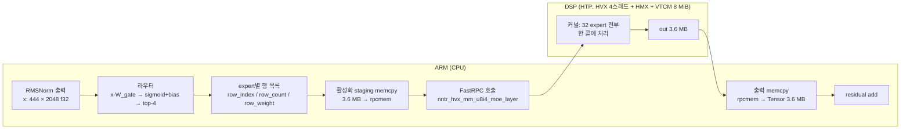

# 49 — LFM2.5-8B-A1B의 MoE FFN을 NPU(HexKL/HMX)로: 무엇을 얼마나 빠르게 했고, 어떻게 도는가 (2026-09-16)

이 문서는 설명용이다. 지금까지의 결과를 사람이 읽고 남에게 설명할 수 있게 한 곳에
모았다. 숫자는 전부 기기 실측(Snapdragon, HTP v79, `NNTR_HTP_PROFILE`/`--profile`)이고,
어디서 나온 값인지 문서 번호를 달았다. 설계 근거와 실패 기록은 문서 46·47·48에 있다.

---

## 1. 한 장 요약

**목표**: LFM2.5-8B-A1B(MoE)의 FFN(expert 행렬곱)을 Qualcomm HTP의 행렬 유닛(HMX)에서
돌려 CPU보다 빠르게. 다른 레이어(conv, attention, norm, lm_head)는 CPU에 두고 비교한다.

| | CPU (KleidiAI int4, 측정 당시 4스레드) | NPU (HexKL HMX) | 배율 |
|---|---:|---:|---:|
| **expert FFN 루프** (한 MoE 레이어 = expert 32개 × [M×2048×3584 → SwiGLU → M×1792×2048], M 합 1776, 39 GFLOP, 크기는 §2.1. 라우터·gather·scatter 제외) | 26.3 ms | **15.2 ms** | **1.7×** |
| ↳ 그중 순수 행렬 유닛 시간 | (KleidiAI GEMM 안에 양자화·f32 출력이 섞여 분리 불가) | HMX 명령 9.25 + acc_read 2.93 = **12.2 ms** | (2.2×, 범위가 다름) |
| **MoE 레이어 전체** (라우터·양자화·전송 포함) | 31.8 ms | **18.4 ms** | **1.7×** |
| **prefill 전체** (444 토큰, 24층) | 279 TPS (1590 ms) | **523 TPS (848 ms)** | **1.9×** |
| **decode** (토큰 1개, MoE 레이어 하나) | 0.88 ms | 1.57 ms | **0.56×** (CPU가 빠름) |

**CPU 열의 출처 — 이번 세션에 새로 잰 값이 아니다.**

| CPU 값 | 어디서 | 언제·조건 |
|---|---|---|
| 레이어 31.8 ms (비-ffn 5.5 + ffn 26.3) | 문서 44 §15.1 P3: `NNTR_M0_PROFILE` 레이어 타이머, **같은 forward 안에서** HTP 레이어(0번)와 CPU 레이어(4–7번 평균)를 나란히 | 2026-09-10, 식은 기기, 기본 스레드(4) |
| prefill 1590 ms → 279 TPS | 문서 43 §7 M0 행: `moe_engine=cpu` 대조 실행 2회에서 MoE 22층 합 841/853 ms가 prefill의 53% → 전체 ≈1590. 문서 46 §18.2가 444/1.590 = 279로 환산 | 2026-09-08, 기본 스레드(4). 같은 날 CPU-only 3회는 1415/2262/2109 ms(열 변동) |
| decode 0.88 ms/레이어, 35 TPS | 문서 48 (CPU 전용이던 빌드) | 2026-09-15 |

즉 279는 **4스레드, 8일 전, 열 상태 불명**의 값이다. NPU 열의 523은 `NNTR_NUM_THREADS=8`(그것만으로
ARM 쪽 −115 ms)이므로 **공정한 비교가 아니다** — CPU-only도 8스레드로 다시 재야 한다.
재는 법: `nntr_config.json`의 `moe_engine`을 `cpu`로, `NNTR_NUM_THREADS=8`, 3회 중 최솟값.
CPU 8스레드가 예컨대 1400 ms(317 TPS)면 prefill 배율은 1.9×가 아니라 1.65×다. 레이어
31.8과 행렬곱 26.3도 같은 이유로 4스레드 값이다.

세 줄로 읽으면:

1. **prefill(여러 토큰)에서는 NPU가 이긴다.** expert FFN 루프는 1.7배, 레이어도 1.7배, 전체
   prefill로는 1.9배. 처음 NPU 버전은 181 TPS로 CPU(279)보다 느렸고, 아래 §5의 최적화로
   523까지 올렸다.
2. **decode(토큰 1개)에서는 아직 CPU가 이긴다.** 토큰 하나는 계산이 아니라 가중치 읽기
   (DDR 대역폭)가 전부라서, 누가 계산하느냐보다 누가 DDR을 빨리 읽느냐다. NPU 경로는
   64행 단위 계산의 낭비와 콜당 전송 비용까지 얹혀 CPU의 0.56배다(문서 48).
3. **NPU 커널은 바닥에 닿았다.** 콜 17.5 ms 중 82%가 하드웨어 구조(HMX 타일, accumulator
   읽기)와 전송 바이트다. 다음 배수는 커널 안이 아니라 ARM과 DSP를 **동시에** 쓰는
   데서 온다(§7).

---

## 2. 무엇을 계산하나 — 모델과 FFN

LFM2.5-8B-A1B: hidden 2048, 24층(conv 18 + attention 6), 그중 22층이 MoE FFN(나머지 2층은
dense FFN). MoE 한 층 = expert 32개, 토큰마다 **top-4**를 고른다. expert 하나는
`gate_up [2048 × 3584]`(gate 1792 + up 1792)와 `down [1792 × 2048]`, 4-bit 가중치.

```
토큰 x (2048)  ─ 라우터 ─▶ 4개 expert 선택, 각각 가중치 w_e
                            ┌─ gate = x·W_gate_e (1792)  ─┐
  expert e:                 │                               ├─ h = silu(gate) ⊙ up ─▶ y_e = h·W_down_e (2048)
                            └─ up   = x·W_up_e   (1792)  ─┘
출력 = Σ_e w_e · y_e   (4개 expert의 가중 합)
```

prefill 444 토큰이면 444 × 4 = **1776개의 (토큰, expert) 행**이 32개 expert에 흩어진다.
expert당 평균 55행. 이것이 행렬곱의 M이 되고, NPU에서는 이 M이 64의 배수로 **패딩**된다.

### 2.1 비교한 행렬곱의 크기

§1의 "26.3 vs 15.2 ms"는 아래 표의 **한 MoE 레이어 전체**(expert 32개, 1776행)다.
CPU와 NPU가 같은 행렬, 같은 행을 계산한다. 다른 것은 NPU가 M을 64행 블록으로 채운다는 점뿐.

**둘 다 실측이고 추정이 아니다. 다만 같은 실행이 아니고, 타이머의 범위가 다르다:**

| | CPU 26.3 ms | NPU 12.2 ms | NPU 15.2 ms (CPU와 같은 범위) |
|---|---|---|---|
| 무엇을 쟀나 | `NNTR_M0_PROFILE`의 `ffn` 타이머: 32 expert 각각 `gate_up.dot` → `swiglu_det` → `down.dot`의 합. KleidiAI int4 GEMM은 안에서 activation을 int8로 양자화하고 f32로 내놓으므로 양자화·dequant가 **안에 포함**된다 | `NNTR_HTP_PROFILE=2`의 `mm` + `acc` 열: HMX 명령 발행 시간 + accumulator 읽기. quant·requant·dequant·SwiGLU·DMA는 **제외** | host 17.5 − transport 2.08 − gather 0.14 − scatter 0.05 − push 0.05. DSP에서 도는 quant·HMX·acc·dequant·SwiGLU·requant·가중치 DMA 전부 |
| 언제·어디 | 2026-09-10, CPU 레이어 4–7번 평균, 4스레드 (문서 44 §15.1) | 2026-09-16, 22 레이어 평균 (문서 47 §22.2) | 같은 실행 |
| 행 | 1776 (444 × 4). 층마다 라우팅이 달라 expert별 M 분포는 다르지만 합은 같다 | 1776 → 패딩 2918 | |

"행렬곱만 2.2배"는 CPU의 GEMM 커널(양자화 포함) 대 NPU의 순수 HMX 시간이라 NPU에 유리한
비교다. 범위를 맞추면 **1.7배**이고, 이것이 레이어 배율 1.7과 같은 이유는 양쪽 다 라우터·
gather·scatter가 작아서다.

**expert 하나의 행렬** (모든 expert, 모든 MoE 층이 같은 모양)

| 행렬곱 | 모양 M × K × N | 가중치 (int4) | 행당 FLOP | 활성화 행당 |
|---|---|---:|---:|---|
| gate_up | M × 2048 × 3584 | 2048×3584 / 2 B = **3.5 MiB** (3.67 MB) | 2·2048·3584 = 14.7 M | 입력 2048 u8 (2 KB), 출력 3584 int32 |
| down | M × 1792 × 2048 | 1792×2048 / 2 B = **1.75 MiB** (1.84 MB) | 2·1792·2048 = 7.3 M | 입력 1792 u8, 출력 2048 int32 |
| expert 합 | | **5.25 MiB** (5.5 MB) | **22.0 MFLOP/행** | |

M은 그 expert로 라우팅된 행 수다. prefill에서는 평균 55(1776/32)이고 32개 중 평균 13.6개가
64를 넘어 두 번째 블록(대개 10~20행)을 만든다. decode에서는 M = 1.

**콜 하나 = MoE 레이어 하나** (prefill 444 토큰)

| | 값 | 비고 |
|---|---:|---|
| 행 (토큰 × top-4) | 1776 | 32 expert에 분산 |
| 유효 FLOP | 1776 × 22.0 M = **39.1 GFLOP** | CPU 26.3 ms → 1.49 TFLOPS |
| NPU가 실제 계산한 행 | 45.6 블록 × 64 = **2918** | 39%가 패딩 |
| NPU가 실제 계산한 FLOP | 2918 × 22.0 M = 64.3 GFLOP | HMX 12.2 ms → 5.3 TFLOPS 원시, 3.2 유효. 같은 범위 15.2 ms면 2.6 유효 |
| HMX 명령 수 | 45.6 × (7168 + 3584) = 490 K | 명령 = 64×32×32 타일, 17.5 ns |
| 가중치 읽기 | 32 × 5.25 MiB = **168 MiB** (176 MB) | CPU는 DDR→캐시, NPU는 DMA→VTCM (17.5 ms에 10 GB/s) |
| 활성화 입력 | 444 × 2048 × 4 B = 3.6 MB f32 | ARM → DSP 전송 |
| 출력 | 444 × 2048 × 4 B = 3.6 MB f32 | DSP → ARM 전송 (합 7.2 MB = transport 2.1 ms의 실체) |
| 모델 전체 expert 가중치 | 22층 × 176 MB = **3.9 GB** | 아레나(ION)에 상주 |

**블록 하나 = 64행** (NPU 안, VTCM에 있는 것)

| 버퍼 | 크기 | 계산 |
|---|---:|---|
| 활성화 블록 (u8) | 128 KB | 64 × 2048 |
| gate_up 결과 (f32) | 458 KB | 64 × 1792 × 4 (gate·up을 SwiGLU로 합친 뒤) |
| mid (u8, down 입력) | 115 KB | 64 × 1792 |
| down 결과 (f32) | 512 KB | 64 × 2048 × 4 |
| gate_up HMX 명령 | 7168 = 64 k타일 × 112 n타일 | ≈ 125 us |
| down HMX 명령 | 3584 = 56 × 64 | ≈ 63 us |

**decode = 토큰 1개**

| | 값 |
|---|---:|
| 행 | 4 (expert 4개에 1행씩, M = 1) |
| FLOP | 4 × 22.0 M = 88 MFLOP |
| 가중치 읽기 | 4 × 5.25 MiB = 21 MiB (≈ 22 MB) |
| 계산 : 읽기 | 4 FLOP/byte — 읽기가 전부 |

---

## 3. CPU와 NPU는 무엇이 다른가 — 속도 차이의 정체

### 3.1 하드웨어

| | CPU (Cortex big.LITTLE, 측정 당시 4스레드) | HTP (HMX + HVX, VTCM 8 MiB) |
|---|---|---|
| 행렬곱 유닛 | NEON i8mm, KleidiAI int4 커널 | **HMX**: 한 명령에 64행 × 32(k) × 32(n) u8×i4 타일 |
| 실측 속도 | 39 GFLOP / 26.3 ms ≈ **1.5 TFLOPS** (에필로그 포함) | 유효 **3.2 TFLOPS**, 패딩 포함 5.3 (mm 17.5 ns/타일) |
| 가중치 읽기 | DDR 직접, 캐시 | DMA로 DDR → VTCM(온칩 8 MiB), 실측 10–16 GB/s (고립 38.8) |
| 활성화 | f32 그대로 | **u8로 양자화**해야 HMX가 먹는다 (행별 scale/zp) |
| 결과 | f32 | int32 accumulator → 읽어내서(acc_read) f32로 되돌린다 |
| 호출 비용 | 0 | FastRPC 콜당 ≈ 2 ms(prefill), 0.16–0.5 ms(decode) |

### 3.2 그래서 왜 1.7배이고 왜 더 못 벌리나

HMX는 명목상 CPU보다 훨씬 빠르지만(5.3 vs 1.5 TFLOPS), 세 가지가 깎아 먹는다.

```
NPU 콜 17.5 ms (prefill, 한 레이어)
├─ HMX 행렬곱   9.25   ← 45.6블록 × 64행. 실제 행은 1776, 패딩 포함 2918 (39%가 빈 행)
├─ acc_read     2.93   ← 타일 결과를 VTCM으로 읽어내는 동안 HMX 정지 (API에 두 번째 acc 없음)
├─ transport    2.10   ← FastRPC + 입력 3.6 MB/출력 3.6 MB 캐시 유지비
├─ requant      1.06   ← silu(gate)·up 을 down용 u8로 다시 양자화
├─ dequant      0.85   ← 에필로그 중 HMX 뒤에 못 숨긴 몫
└─ 나머지       1.3    ← quant·stage·drain·gather·scatter…
```

- **패딩**: HMX 블록은 64행 고정이라 expert에 10행이 와도 64행 값을 낸다. 39%가 허공.
- **acc_read**: HexKL micro API가 accumulator 하나만 노출한다. 읽는 동안 계산이 선다.
- **전송**: NPU는 딴 칩이다. 활성화를 보내고 결과를 받는 데 콜당 2 ms.

CPU는 이 셋이 없다. 그래서 "명목 3.5배"가 HMX 시간만 세면 2.2배, CPU와 같은 범위(양자화·
SwiGLU·DMA 포함)로 세면 **1.7배**가 된다. 레이어 전체로는 라우터와
양자화, ARM 쪽 준비가 더해져 1.7배.

### 3.3 decode는 왜 CPU가 이기나

토큰 1개는 expert 4개의 가중치 21 MiB(≈ 22 MB, §2.1)를 읽어 88 MFLOP를 계산한다. 계산은 0에 가깝고
**읽기가 전부**다.

| | CPU | NPU |
|---|---:|---:|
| 가중치 읽기 | 22 MB, 실측 0.88 ms (≈ 24 GB/s) | DMA 22 MB / 15.7 GB/s = 1.37 ms |
| 계산 | 읽기에 묻힘 | HMX가 1행에 64행 타일 = 1.03 ms (읽기와 겹침) |
| 호출 | 0 | +0.16–0.5 ms |
| **레이어** | **0.88** | **1.57** |

NPU가 이기려면 DMA를 38 GB/s로(D1), 콜당 전송을 상주 워커로(D2), 64행 타일을 HVX
GEMV로(D3) 셋 다 넘어야 한다(문서 48 §3). WH 가중치 포맷은 CPU 커널이 없어서 지금은
decode도 강제로 NPU를 탄다 — 20 TPS(CPU 전용이던 때 35).

---

## 4. 흐름 시각화 — FFN 한 층이 NPU에서 도는 길

### 4.1 큰 그림: ARM ↔ DSP



원래는 expert마다 콜 하나(32콜)였다. 콜당 2 ms 전송이 32번이면 64 ms라, **레이어 하나를
콜 하나**로 만든 것이 출발점이다(문서 46 "resident kernel").

### 4.2 DSP 안: 콜 하나의 파이프라인

```mermaid
flowchart TB
  S0[입력 f32 3.6 MB<br/>DMA로 힙에 복사] --> S1[행별 scan<br/>min/max → scale, zp]
  S1 --> S2[pack: f32 → u8 AH 타일<br/>expert 순서(slot)로<br/>백그라운드 레인, 16행 유닛]
  S2 --> E["expert e (활성 32개 순서대로)"]
  subgraph E["expert e"]
    direction TB
    W1[DMA: gate_up 3.5 MB<br/>쌍 청크 4개<br/>이전 expert의 down 중에 미리] --> H1
    W2[DMA: 활성화 64행 블록 128 KB] --> H1
    H1[HMX gate_up<br/>배치 = 16쌍 × 64 k타일<br/>acc → staging A/B 교대] --> P1
    P1[워커 3개: dequant + SwiGLU 융합<br/>→ gate f32 VTCM<br/>다음 배치 HMX 뒤에 숨음] --> R1
    R1[requant: gate f32 → mid u8<br/>동기, 숨길 곳 없음] --> H2
    W3[DMA: down 1.75 MB<br/>gate_up 중에 미리] --> H2
    H2[HMX down<br/>배치 32타일] --> P2
    P2[워커: dequant → res f32] --> SC
    SC[scatter: out[row] += w · res<br/>비동기, 다음 블록 뒤에 숨음]
  end
  E --> S9[out 3.6 MB<br/>DMA로 rpcmem에 복사]
```

핵심은 **겹치기**다. HMX가 배치 j+1을 계산하는 동안 워커 스레드들이 배치 j의 에필로그를
하고, DMA는 다음 expert의 가중치를 끌어온다. 콜 안에서 세 장치(HMX, HVX 워커, DMA)가
동시에 돈다. 숨기지 못하는 것은 requant(1.06)와 각 블록의 마지막 에필로그(0.85)뿐이다.

### 4.3 시간축으로 본 블록 하나 (64행, ≈ 380 us)

```
HMX   │gu b0│gu b1│gu b2│gu b3│      │dn b0│dn b1│      │gu b0(다음 블록)…
      │ 47  │ 47  │ 47  │ 24  │      │ 47  │ 30  │      │
워커  │     │ep b0│ep b1│ep b2│ep b3 │requant│ep d0│ep d1 │scatter (다음 블록 뒤)
      │     │ 18  │ 18  │ 18  │ 18 ← 노출│27│  8  │ 8 ← 노출│
DMA   │ down(e) 1.75 MB ─────────▶│         │ gate_up(e+1) 3.5 MB ─────▶ act(e+1)
```

gu = gate_up 배치, ep = dequant+SwiGLU 에필로그, dn = down 배치. 숫자는 us.
"노출"이 프로파일의 `dequant`·`requant` 열이다.

### 4.4 VTCM 8 MiB의 배치 (콜 시작 시 고정)

```
┌──────────┬──────────────────────────┬────────────────┬──────────┬───────┬────────────┬──────────┐
│ act 128K │ gate_up W 3.5 MB         │ down W 1.75 MB │ gate f32 │ mid   │ acc 2×256K │ res f32  │
│ 64행 u8  │ (expert e, 다음 e+1이 덮음)│ (down 중 덮음) │ 458 KB   │ 115 KB│ staging A/B│ 512 KB   │
└──────────┴──────────────────────────┴────────────────┴──────────┴───────┴────────────┴──────────┘
합 6.92 MB. 가중치는 이중 버퍼가 아니다(10.5 MB는 안 들어간다) — 시간차로 같은 버퍼를 재사용한다.
```

### 4.5 HMX 타일과 패딩

```
HMX 한 명령: A[64행 × 32k] u8  ×  W[32k × 32n] i4  →  acc[64 × 32] int32 (+=)
한 블록(64행)의 gate_up = 64 k타일 × 112 n타일 = 7168 명령 ≈ 125 us, down = 56 × 64 = 3584 ≈ 63 us
                                                         acc_read 176회 ≈ 65 us
                                                         ─────────────────────
                                                         블록 고정비 ≈ 252 us
expert에 10행이 오든 64행이 오든 252 us. 1776행이 45.6블록(2918행)으로 → 39%가 패딩.
```

---

## 5. 적용한 최적화 — 무엇을, 왜, 얼마나

prefill TPS의 경로: **181 → 353 → 361 → 376 → 480 → 494 → 523**. 순서대로.

| # | 이름 | 무엇을 했나 | 왜 빨라졌나 | 실측 효과 | 문서 |
|---|---|---|---|---|---|
| 1 | **P6 등록을 로드로** | 1408개 expert 가중치의 FastRPC 등록·아레나 복사를 첫 forward가 아니라 모델 로드 때 | prefill 시간에 등록 747 ms가 섞여 있었다 | prefill −747 ms (181 → 272 TPS) | 47 §1 |
| 2 | **P2 DMA 순서** | 활성화 블록 DMA를 가중치 5.25 MB보다 **먼저** 큐에 | DMA 링은 순서대로 완료된다. 뒤에 넣으면 128 KB 기다리는 데 5 MB를 다 기다린다 | 콜당 −2.8 ms ("gather 고정비"의 정체) | 47 §2 |
| 3 | **P1 세션 스크래치** | 콜마다 하던 12.8 MB malloc/free를 세션 수명의 블록으로 | 힙 할당 3 ms/콜 | 콜당 −2.7 ms | 47 §3 |
| 4 | **G 가중치 청크 DMA** | gate_up 3.5 MB를 4개 청크로 나눠 첫 청크가 오면 HMX 시작 | 전체를 기다리면 110 us 손실 | 소 | 47 §10 |
| 5 | **A dequant+SwiGLU 융합** | gate·up 타일을 각각 f32로 쓰고 다시 읽어 SwiGLU 하던 것을 한 패스로 | VTCM 왕복 제거 | −0.15 ms/콜 (예측 −1.8. SwiGLU가 HVX 계산 바운드였다) | 47 §10.1 |
| 6 | **B 에필로그 비동기** | dequant·SwiGLU·scatter를 워커 풀에 submit하고 다음 배치 HMX 뒤에 숨김 | HMX와 HVX 동시 사용. acc staging 2벌 | 361 → 376 TPS | 47 §11 |
| 7 | **scatter 대기 위치** | scatter 완료 대기를 블록 머리가 아니라 다음 블록 첫 배치 뒤로 | 머리에서 기다리면 숨길 게 3 us뿐 | scatter 1056 → 23 us/콜 | 47 §11.1 |
| 8 | **E0 lm_head twin을 로드로** | lm_head의 blocked Q4_0 복제본(75 MB repack)을 첫 prefill이 아니라 로드 때 | 첫 콜 64 ms가 prefill에 | 첫 콜 64 → 5.6 ms | 47 §15·17 |
| 9 | **E1 ARM 쪽 낭비 제거** | HTP 경로에서도 만들던 CPU용 워크스페이스 4개(zero-fill)와 setZero를 가속 실패 뒤로 | 층마다 4–17 MB memset + **페이지 폴트** | MoE 22층 ARM 쪽 276 → 20 ms, **376 → 480 TPS** | 47 §16·17 |
| 10 | **O2 팩을 백그라운드로** | 활성화 팩(1.0 ms, HMX 놀림)을 워커 풀의 백그라운드 레인에서 16행 유닛으로; 블록을 큐잉하기 직전에만 대기 | HMX가 도는 동안 워커 유휴 시간에 팩 | quant 1440 → 354 us/콜 | 47 §19 |
| 11 | **gather 조기 큐잉** | 같은 expert의 다음 블록 활성화 DMA를 현재 블록의 gate_up이 끝나는 시점에 | requant·down 뒤에 숨는다 | 5.0 → 3.0 us/블록 | 47 §22 |
| 12 | **로드 시 워밍업** | 등록 뒤 더미 콜 1회 | 스크래치 성장·페이지 첫 접촉을 prefill 밖으로 | alloc 109 → 52 us/콜 | 47 §22 |
| 13 | **워커 spin-before-sleep** | 워커가 잠들기 전 100 us 대기 | 47 us마다 오는 submit이 futex 깨우기(수 us × 3)를 안 낸다 | dequant 1237 → 849, requant 1271 → 1059, **494 → 523 TPS** | 47 §22.2 |
| — | 스레드 8개 | `NNTR_NUM_THREADS=8` (코드 아님) | ARM GEMM이 8코어를 씀 | prefill 1039 → 924 (4 → 8) | 47 §15.4 |

**해봤지만 안 된 것** (기록이 다음 사람을 아낀다):

| 이름 | 무엇 | 결과 | 왜 |
|---|---|---|---|
| **O1 꼬리 블록을 HVX로** | 16행 이하 둘째 블록을 HMX 대신 HVX GEMV로 (백그라운드 레인, 비트동일) | 콜당 **+0.3 ms 손해**, 기본 OFF | 대상이 콜당 3.5개뿐(최대 0.9 ms), 워커가 유닛 중이면 에필로그 submit이 기다림(+0.6), 꼬리가 제때 안 끝남(+0.45) | 47 §21 |
| **O4 requant 스캔 융합** | 행 min/max를 SwiGLU 에필로그에서 추적 | 효과 0, 되돌림 | requant 열의 정체는 스캔이 아니라 워커 깨우기였다 → #13이 진짜 답 | 47 §22.1 |
| **acc_read 숨기기** | 두 번째 accumulator로 읽기와 계산 겹치기 | 불가 | HexKL micro API에 accumulator 선택이 없다 | 47 §20.4 |
| **C 활성화를 ARM에서 u8로** | 전송 바이트 반감(−0.9 ms/콜) | 보류 | "CPU를 쓰지 않는다"는 비교 조건 | 47 §12 |

---

## 6. 어떻게 쟀나 — 재현 방법

```bash
# 1. skel(DSP 커널)과 앱 빌드
bash test/htp/build.sh && adb push .../libnntr_hvx_skel.so <device>
cd Applications/CausalLM && ./build_android.sh --htp && ./install_android.sh --model=<모델>

# 2. TPS (3회 중 최솟값을 쓴다 — ARM 클록·발열로 ±30 ms 흔들린다)
adb shell "cd /data/local/tmp/nntrainer/causallm && NNTR_NUM_THREADS=8 LD_LIBRARY_PATH=. ADSP_LIBRARY_PATH=. ./nntrainer_causallm ./models/<모델>"

# 3. 커널 분해 (DSP 안의 단계별 us, 22콜 평균, ARM 클록과 무관)
NNTR_HTP_PROFILE=2 ... ./nntrainer_causallm ...   # [HTP-PROFILE] M>1 행
NNTR_HTP_PROFILE=3 ...                            # 같은 콜을 5회 반복해 최솟값 (온도·경합 제거)

# 4. 레이어(노드)별 시간: --profile 빌드
./build_android.sh --htp --profile → [PROFILE] 표 (max = prefill 콜, sum−max = decode)
# 5. MoE 레이어의 ARM 쪽 분해
NNTR_M0_PROFILE=1 ...   # [M0-PROF] setup/router/topk/wksp/gather/ffn/route/scatter/other
```

`[HTP-PROFILE] M>1` 행 읽는 법: `host` = FastRPC 왕복 포함 콜 시간, `dsp` = 커널 안,
`transport` = 둘의 차. 대괄호 안이 dsp의 분해이고 §3.2의 막대가 그것이다. `blocks`가 HMX
블록 수(패딩의 척도).

**출력이 같은지가 정확성 검사다.** 이 작업의 모든 변경은 출력 바이트가 같아야 한다(int32
정수 합, 같은 dequant/SwiGLU/양자화 함수, 같은 합산 순서). 텍스트 비교로 매 단계 확인했다.
호스트에서는 `test/htp/host/run_host_checks.sh`가 커널의 루프 구조와 워커 풀을 스칼라
스탠드인으로 검사한다.

---

## 7. 남은 것

**prefill, FFN 범위 안**: 콜 17.5 ms 중 14.3(82%)이 바닥이다. 남은 3.2 ms는 열 개로 쪼개져
있고 각각 1% 이하라 사실상 끝났다(47 §22.2).

**prefill, 그 위**: 지금은 ARM 520 ms + DSP 400 ms = 920이 **합**이다. 토큰을 두 청크로
나눠 청크1의 MoE가 DSP에서 도는 동안 ARM이 청크2의 conv/attention을 돌리면 **max**가
된다 — 약 650 ms, 700 TPS. 레이어를 옮기지 않고 실행 순서만 바꾸는 것이지만, 그래프
실행기와 FastRPC 비동기화가 필요한 큰 작업이다(47 §20.1의 10번).

**decode**: DMA 처리량(16 → 38 GB/s), 콜당 전송(0.4 ms × 22 = 9 ms/token), 64행 타일의
세 벽을 다 넘어야 CPU(35 TPS)를 이긴다(문서 48). 하나만 넘으면 20대에 머문다.

---

## 8. 용어

| 용어 | 뜻 |
|---|---|
| HTP / DSP | Qualcomm Hexagon 프로세서. 여기서 NPU 역할 |
| HMX | Hexagon Matrix eXtension. 64×32×32 타일 행렬곱 유닛 |
| HVX | Hexagon Vector eXtension. 128바이트 SIMD. 양자화·dequant·SwiGLU를 여기서 |
| VTCM | DSP의 온칩 메모리 8 MiB. HMX는 여기서만 읽는다 |
| HexKL | Qualcomm의 HMX/HVX 커널 라이브러리. `hexkl_micro_hmx_*` |
| FastRPC | ARM ↔ DSP 원격 호출. 콜당 고정비 + 버퍼 캐시 유지비 |
| 아레나 | DSP가 볼 수 있는 ION 메모리 3.84 GB. expert 가중치 전부가 여기 상주 |
| WH / AH | HMX가 읽는 가중치/활성화 타일 배치. WH는 오프라인 양자화기가 만든다 |
| QS4CX(_WH) | 4-bit 채널별 스케일 가중치 포맷 (_WH: HMX 타일 순서로 미리 배치) |
| expert / top-k | MoE의 FFN 조각 / 토큰당 고르는 expert 수(4) |
| 블록 | HMX가 한 번에 처리하는 64행 |
| 에필로그 | HMX int32 결과를 f32로 되돌리는 dequant, 그 뒤 SwiGLU |
| requant | silu(gate)·up f32를 down 행렬곱용 u8로 다시 양자화 |
| scatter | expert 출력을 라우팅 가중치 곱해 토큰 행에 더하기 |
| 백그라운드 레인 | 워커 풀에서 에필로그 사이 유휴에 도는 작은 잡의 큐 |
